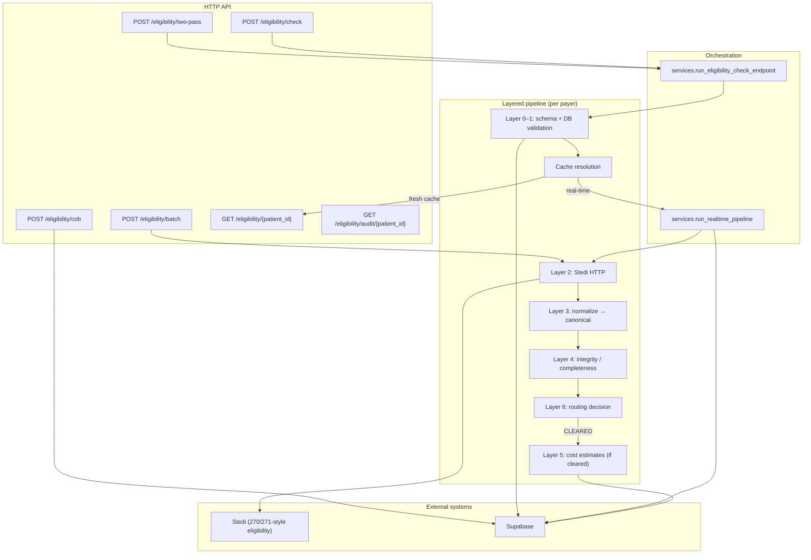

# Eligibility Agent — End-to-End Workflow

This document describes how the **Vanguard MD Eligibility Agent** service works: HTTP surface, layered processing (0–7), Stedi integration, Supabase persistence, caching, and coordination-of-benefits (COB).

The implementation lives under `app/eligibility/`. The FastAPI app is defined in `main.py`.

### Provider fee network (production shape)

Stedi’s 271 may not reliably indicate whether **your office** is in-network for **fee** purposes.
When **`practice_id`** and **`rendering_provider_npi`** (and optionally **`provider_service_location_key`**)
are sent on `EligibilityRequest`, Layer 5 resolves **`rcm.provider_payer_network`** and sets
**`canonical["in_network_for_fees"]`** for `calculate_responsibility`; the payer’s raw network flag
remains in **`canonical["in_network"]`** (and `in_network_from_payer_271` on the canonical snapshot).
Demo seed data: migrations `039_provider_payer_network_directory.sql`, `040_mock_clinic_practices_and_seed.sql`;
identifiers in `mock_clinic.py`.

---

## 1. How to run the service

From the repo root (with dependencies installed and `.env` configured):

```bash
uvicorn app.eligibility.main:app --reload --host 0.0.0.0 --port 8010
```

Health check: `GET /health` → `{"status":"ok","service":"eligibility_agent"}`.

---

## 2. High-level architecture



---

## 3. Layer model (what each layer does)

| Layer | Responsibility | Primary modules |
|------|----------------|-----------------|
| **0** | Request schema: Pydantic validation on `EligibilityRequest` (types, required fields, stripped IDs). | `models.py` |
| **1** | **Business validation against Supabase:** primary/secondary payer must exist in `payer_network` with `coverage_type = dental`; CDT codes are filtered to those present in `cdt_codes` (invalid codes removed with warnings). Failures raise `Layer1ValidationError` with stable codes (`L1_INVALID_PRIMARY_PAYER`, `L1_INVALID_SECONDARY_PAYER`). | `triggers.py` (`layer0_supabase_validation`), `db.py` |
| **2** | **Stedi:** build JSON payload (`build_payload`), POST with `Key` auth, retries on 429/5xx with backoff, require JSON **object** responses. Secondary payer uses the same payload shape with a different `tradingPartnerServiceId` (independent call, never merged in-flight). | `api_client.py` |
| **3** | **Normalize** Stedi 271-shaped JSON into an internal **canonical** record (coverage flags, deductibles, annual max, procedure-level details, timestamps, normalization version). | `normalizer.py` |
| **4** | **Integrity / completeness:** set `response_complete` and `missing_fields` from critical fields; attach `integrity_warnings` and structured issues; range/consistency checks. | `integrity.py` |
| **5** | **Cost / patient responsibility:** when routing is `CLEARED` and response is complete/active, load `payer_fee_schedules`, compute allowed / insurance / patient amounts per CDT, insert `procedure_estimates`. Uses **`in_network_for_fees`** from `provider_payer_network` when present, else 271 **`in_network`**. Failures here are logged and skipped (check still stored). | `cost_calculator.py`, `db.py` |
| **6** | **Routing:** map canonical state to one of **INACTIVE**, **INCOMPLETE**, **NOT_COVERED**, **CLEARED** — with actions (`notify_front_office_*`, `route_coding`, `route_prior_auth` if DB rules say prior auth required). | `router.py` |
| **7** | **COB:** combine **two completed** eligibility checks (primary + secondary) using stored `procedure_estimates` — not part of the single-check Stedi call. | `cob.py` |

Layers 3–6 run inside `run_realtime_pipeline` for each payer (primary, then optional secondary).

---

## 4. Main workflow: `POST /eligibility/check`

### 4.1 Request body (`EligibilityRequest`)

- **patient_id** (UUID), **first_name**, **last_name**, **dob**, **subscriber_id**, **primary_payer_id** (Stedi `tradingPartnerServiceId`)
- Optional **secondary_payer_id** (triggers a second full pipeline for the secondary payer)
- Optional **cdt_codes** (list; empty/omitted allowed)
- **trigger_event**: `NEW_PATIENT` | `APPOINTMENT_BOOKED` | `PRE_APPOINTMENT` | `BATCH_SWEEP` (the last is rejected here — use batch route)
- Optional **ssn** / **mbi** — if SSN is present, an audit event is written (`SSN_FALLBACK`); subscriber ID remains the preferred identifier for Stedi.
- Optional **practice_id**, **rendering_provider_npi** (10-digit), **provider_service_location_key** — when set, Layer 5 resolves `provider_payer_network` for fee-path network (see above).
- Optional **provider_organization_name** — overrides Stedi **`provider.organizationName`** (default **`PROVIDER_NAME`**) when not using person-provider fields.

### 4.2 Step-by-step

1. **Layer 0–1** — `layer0_supabase_validation`: normalize payer IDs and CDT list; validate payers; drop unknown CDT codes with warnings (`layer0_warnings` in response).

2. **Cache vs API** — `resolve_cached_vs_api`:
   - **`PRE_APPOINTMENT`** always forces a new Stedi call (`"api"`).
   - **`NEW_PATIENT`** always forces API.
   - **`APPOINTMENT_BOOKED`**: if the latest row for `(patient_id, primary_payer_id)` is **within** `ELIGIBILITY_CACHE_TTL_DAYS` and policy says not to refresh, return **`cached: true`** with the latest DB record (no Stedi call). Otherwise run API path.

3. **If cache hit** — Response: `{ cached: true, record: <row>, layer0_warnings: [...] }`. No new `eligibility_checks` row for that request.

4. **If API path — primary payer** — `run_realtime_pipeline` with `coverage_order="primary"` and `trading_partner_service_id=primary_payer_id`:
   - `call_stedi(build_payload(...))`
   - `normalize` → `validate_completeness` → `route`
   - Strip internal keys from raw JSON before storing `raw_response`
   - `insert_eligibility_check` with canonical + routing + raw
   - If **CLEARED** and complete/active: fee schedule + `calculate_responsibility` → `insert_procedure_estimates`

5. **Secondary payer (optional)** — If `secondary_payer_id` is set, repeat `run_realtime_pipeline` for the secondary payer (same patient/member context, different trading partner ID). Primary and secondary are **two independent** Stedi requests and **two** `eligibility_checks` rows.

6. **Audit** — `write_audit_event` with routing summary and check IDs.

7. **Response shape** (`EligibilityCheckHttpResponse`):
   - `cached`, `layer0_warnings`
   - `primary`: `{ check_id, canonical, routing, procedure_estimates }` (structure returned from pipeline)
   - `secondary`: same shape or `null`
   - `record`: populated for cache path; otherwise typically `null` depending on implementation (see `services` return dict)

### 4.3 HTTP errors

| Condition | Status | Notes |
|-----------|--------|--------|
| `Layer1ValidationError` | 400 | `detail` includes `code`, `layer: "layer1"`, `detail` |
| Other `ValueError` | 400 | Plain message |
| `StediAPIError` | 502 | Stedi/network/JSON failures |
| `RuntimeError` (e.g. missing Supabase config) | 503 | Configuration |
| Missing DB when required | 503 / runtime | `SUPABASE_URL` / `SUPABASE_KEY` must be set for DB-backed steps |

---

## 5. Batch workflow: `POST /eligibility/batch`

- Body: `EligibilityBatchRequest` with `items[]` and **`trigger_event` must be `BATCH_SWEEP`**.
- For each item: Layer 0–1 validation, `build_payload`, attach `_patientId`; **no** per-item `run_realtime_pipeline` loop.
- Single `call_stedi_batch` with all item payloads to Stedi’s **manager** batch endpoint.
- Writes an audit event (`ROUTING`, batch metadata).
- Response: `{ batch_submitted, stedi_response, items_count }`.

Use this for scheduled sweeps; it does not populate `eligibility_checks` through the same normalization path as realtime (batch handling is submit-oriented).

---

## 6. Two-pass workflow: `POST /eligibility/two-pass`

Orchestrates **coding agent** + eligibility:

1. **Pass 1** — Clone request with **`cdt_codes` cleared** → `run_eligibility_check_endpoint` (coverage gate without procedures).
2. If primary routing status is not **`CLEARED`**, return immediately with `halted_after_pass1: true` and a reason (no coding, no pass 2).
3. Else run **`run_coding_agent`** (from `app.agents.coding_agent`) with clinical note, age, insurance string — requires main app settings and Supabase.
4. **Pass 2** — Eligibility again with generated CDT codes and `trigger_event=PRE_APPOINTMENT` to force fresh benefits for procedures.

Response: `pass1`, optional `coding`, optional `pass2`, optional halt fields.

---

## 7. COB workflow: `POST /eligibility/cob`

- Input: `primary_eligibility_check_id`, `secondary_eligibility_check_id`.
- Loads both rows from `eligibility_checks`; requires **`response_complete`** on both.
- Loads `procedure_estimates` for each check.
- **`calculate_cob`** (Layer 7): per-CDT aggregation, secondary pays toward patient responsibility after primary, decimal rounding — see `cob.py` for policy version and formulas.
- Writes audit event.

---

## 8. Read APIs

| Method | Path | Behavior |
|--------|------|----------|
| GET | `/eligibility/{patient_id}` | Latest `eligibility_checks` row for patient + `procedure_estimates` for that check |
| GET | `/eligibility/audit/{patient_id}` | Recent `eligibility_audit_log` entries |

---

## 9. Environment configuration

Defined in `config.py` (typical variables):

| Variable | Purpose |
|----------|---------|
| `STEDI_API_KEY` | Required for realtime/batch HTTP calls |
| `STEDI_BASE_URL` | Healthcare API base (default Stedi US healthcare URL) |
| `STEDI_ELIGIBILITY_PATH` | Realtime eligibility path |
| `STEDI_MANAGER_BASE_URL` | Batch manager host |
| `STEDI_BATCH_ELIGIBILITY_PATH` | Batch endpoint path |
| `STEDI_TIMEOUT_SECONDS`, `STEDI_BATCH_TIMEOUT_SECONDS` | HTTP timeouts |
| `STEDI_MAX_RETRIES`, `STEDI_RETRY_*` | Retry/backoff tuning |
| `SUPABASE_URL`, `SUPABASE_KEY` | Required for Layer 1, persistence, fees, audit |
| `PROVIDER_NPI`, `PROVIDER_NAME`, `PROVIDER_TAX_ID` | Sent in Stedi provider block |
| `ELIGIBILITY_CACHE_TTL_DAYS` | Cache freshness for `APPOINTMENT_BOOKED` |
| `AZURE_OPENAI_ENDPOINT` | Not required by core eligibility pipeline (used elsewhere if integrated) |

Use a `.env` file in the working directory or set variables in the process environment.

---

## 10. Database touchpoints

The agent expects Supabase tables including (names as used in code):

- **`payer_network`** — dental payers (`trading_partner_service_id`, `coverage_type`)
- **`practices`** — clinic / tenant registry (`040_mock_clinic_practices_and_seed.sql`)
- **`provider_payer_network`** — per practice + rendering NPI + payer fee-path (`in_network_for_fees`; `039`/`040`)
- **`cdt_codes`** — valid procedure codes for Layer 1 filtering
- **`eligibility_checks`** — one row per Stedi run (primary or secondary)
- **`procedure_estimates`** — per-CDT financial estimates when Layer 5 runs
- **`payer_fee_schedules`** — contracted fees for Layer 5
- **`payer_prior_auth_rules`** — optional prior-auth flags for Layer 6
- **`eligibility_audit_log`** — audit trail (cache hits, routing, SSN path, batch, COB)

Migrations under `supabase/migrations/` (e.g. `020_eligibility_agent.sql` and later domain refactors) define or move these objects.

---

## 11. Related documentation in repo

- `docs/eligibility-layer1-contract.md` — Layer 1 validation contract
- `docs/eligibility-layer23-checklist.md` — Layer 2–3 testing checklist

---

## 12. File map (quick reference)

| File | Role |
|------|------|
| `main.py` | FastAPI routes, error mapping |
| `services.py` | `run_eligibility_check_endpoint`, `run_realtime_pipeline` |
| `models.py` | Request/response models, `StediAPIError`, `Layer1ValidationError` |
| `triggers.py` | Cache policy, `layer0_supabase_validation`, `resolve_cached_vs_api` |
| `api_client.py` | Stedi payload, `call_stedi`, `call_stedi_batch` |
| `normalizer.py` | 271 JSON → canonical |
| `integrity.py` | Layer 4 completeness |
| `cost_calculator.py` | Layer 5 estimates |
| `router.py` | Layer 6 routing |
| `cob.py` | Layer 7 COB |
| `db.py` | Supabase access |
| `audit.py` | Audit writes |
| `sanitize.py` | Log/storage scrubbing |

This README reflects the intended production flow: **validate → optionally use cache → call Stedi → normalize → verify → route → estimate costs when safe → persist and audit**; **COB** is a separate post-check step when two completed checks exist.
