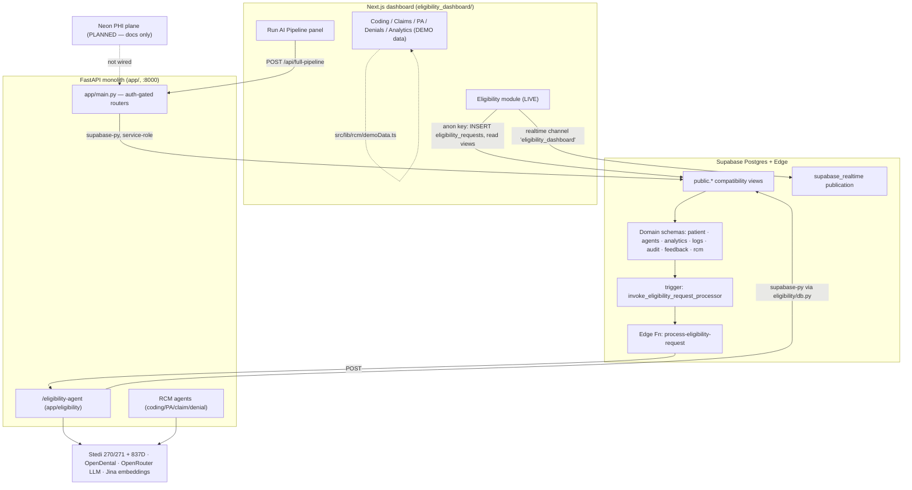
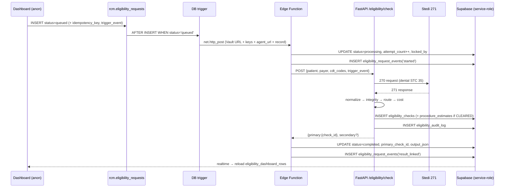
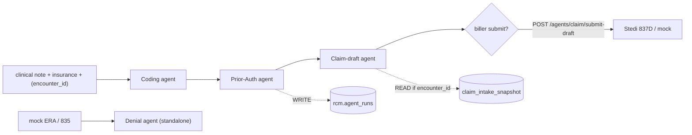
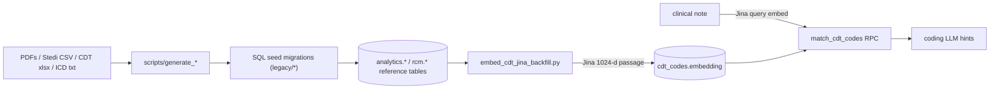

# Vanguard MD — Database Operational Guide

**Status:** Living document · reconciled against `supabase/migrations/000_baseline_production_schema.sql` (live-schema baseline, 2026-06-15)
**Audience:** Engineers operating, debugging, and extending the data layer
**Scope:** The Supabase Postgres database and **how data moves through it** — who writes each row, who reads it, what workflow it serves, and how its state evolves.

> This is an *operational* reference, not a column dictionary. For exact column
> types and constraints, read the baseline migration. For "what does this table
> mean and who touches it," read here.

---

## 1. How to read this guide

Every table section uses the same structure so you can scan it:

- **Purpose** — the business object it represents.
- **Owner / writers** — the component(s) that create or mutate rows. This is the single most important field operationally: if a row is wrong, start with its owner.
- **Readers** — who consumes it.
- **Read/write paths** — concrete files and the operation each performs.
- **Lifecycle / state** — status transitions and who drives them.
- **Triggers / RLS / realtime** — DB-side behavior attached to the table.
- **Relationships** — foreign keys in/out.
- **Notes & gaps** — drift between schema intent and what the code actually does.

**Ownership legend** used throughout:

| Tag | Meaning |
| --- | --- |
| 🟢 **Live** | Written/read by running application code today |
| 🟡 **Partial** | Schema + some wiring, but a major path (writer or UI) is missing |
| ⚪ **Schema-only** | Table exists and is reserved for a workflow, but no app code reads/writes it |
| 🔵 **Reference** | Seeded once from migrations/scripts; read-mostly at runtime |
| 🔴 **External** | Written by something outside this repo (n8n, a front-desk app) |

---

## 2. System topology

### 2.1 The two-plane intent vs. today's reality

The [execution plan](vanguard-production-execution-plan.md) commits to a **two-plane architecture**: PHI (patients, encounters, eligibility, claims, audit) on **Neon** behind FastAPI, and non-PHI reference/rules/RAG on **Supabase**. **As of this baseline, that split has not happened** — every table below lives in one Supabase project, `NEON_DATABASE_URL` is documented in `.env.example` but referenced by **no** `app/` code, and the browser reads PHI-shaped eligibility rows directly with the anon key. Treat the plane split as the target state, not the current one.

### 2.2 Schema architecture: domain tables + `public` views

Real tables live in **seven domain schemas** (`patient`, `agents`, `analytics`, `logs`, `audit`, `feedback`, `rcm`). The `public` schema holds **one bridge view per table** (`create view public.X as select * from <domain>.X`), plus a handful of aliases (`public.denials` → `rcm.denied_claims`, `public.claim_submissions` → `rcm.accepted_claims`, etc.).

**Operational consequence:** all application code (supabase-py, supabase-js, PostgREST) addresses tables by their **unqualified `public` name** (`supabase.table("eligibility_requests")`). The domain schema is transparent to the app. When you see `eligibility_requests` in code, the row physically lives in `rcm.eligibility_requests`. Grants and RLS are applied on the underlying domain tables; the `public` views inherit broad grants (see §7).

### 2.3 Database access layers

| Layer | Client | Key posture | Files |
| --- | --- | --- | --- |
| FastAPI main app | `supabase-py` singleton | **service-role** (RLS-bypassing), falls back to anon | `app/integrations/supabase_client.py` (`get_supabase_client`, `create_supabase`) |
| FastAPI eligibility sub-app | separate `supabase-py` singleton | service-role / `SUPABASE_KEY` | `app/eligibility/db.py` (`get_supabase`) |
| Next.js dashboard | `supabase-js` browser singleton | **anon** (`NEXT_PUBLIC_SUPABASE_ANON_KEY`) | `eligibility_dashboard/src/lib/supabase.ts` |
| Edge Function | `supabase-js` | service-role key passed in webhook payload (anon fallback) | `supabase/functions/process-eligibility-request/index.ts` |
| Schema/seed scripts | `psycopg` direct | `DATABASE_URL` / `SUPABASE_DB_PASSWORD` | `scripts/apply_*_schema.py`, generators |

There is **no asyncpg/SQLAlchemy and no `app/db.py`** in runtime code — all runtime DB I/O is supabase-py against `public` views. Direct Postgres (`psycopg`) is confined to one-off schema/seed scripts.

### 2.4 Realtime

A single frontend channel (`eligibility_dashboard` in `EligibilityDashboard.tsx`) subscribes to five `rcm.*` tables. The `supabase_realtime` publication additionally includes `agents.rcm_tasks`, `logs.coding_log`, and `rcm.denied_claims` for **future** live UIs that don't yet subscribe. See §6.

---

## 3. Status vocabularies (canonical reference)

Centralized here because the same literals recur across tables, code, and UI.

| Field | Allowed values | Enforced by |
| --- | --- | --- |
| `eligibility_requests.status` | `queued` · `processing` · `retrying` · `completed` · `failed` · `needs_attention` | CHECK constraint |
| `eligibility_requests.trigger_event` | `NEW_PATIENT` · `APPOINTMENT_BOOKED` · `PRE_APPOINTMENT` · `BATCH_SWEEP` | CHECK |
| `eligibility_requests.priority` | `low` · `medium` · `high` | CHECK |
| `eligibility_requests.failure_category` | `config_error` · `agent_error` · `payer_error` · `timeout` · `validation_error` · `unknown` | CHECK |
| `eligibility_requests.coverage_status` | `active` · `inactive` · `unknown` | CHECK |
| `eligibility_checks.routing_status` | `INACTIVE` · `INCOMPLETE` · `NOT_COVERED` · `COVERAGE_AMBIGUOUS` · `CLEARED` | app convention (no CHECK) |
| `eligibility_checks.coverage_order` | `primary` · `secondary` | CHECK |
| `claim_intake_snapshot.intake_status` | `draft` · `ready` · `submitted` · `archived` | CHECK |
| `agent_runs.status` | `pending_review` (only literal used) | default only, no CHECK |
| `agent_decisions.status` | code uses `pending_review` → `approved`/`rejected` (**schema default is `pending`**) | default only |
| `encounters.status` | `pending` → `coded` | default only |
| `claims.status` | `draft` (unused beyond default) | default only |
| `rcm_tasks.status` | default `pending` (no app writer) | default only |
| `denied_claims.status` | default `pending` (no app writer) | default only |
| `coding_log.status` | harness writes the *step name* (`start`, `completed`, …) | default only |

> **Edge-function-only status writes:** `eligibility_requests` transitions to `processing`/`completed`/`failed`/`retrying`/`needs_attention` are performed **exclusively** by the Edge Function with the service-role key. The browser can only `INSERT` (status `queued`) — `UPDATE` is revoked from `anon`/`authenticated` on `public.eligibility_requests`.

---

## 4. End-to-end data flows

### 4.1 Eligibility verification (the one fully-live workflow)

This is the only flow wired end-to-end through the database.

**Narrative.** A front-desk user (or a rerun/retry button) inserts a row into `eligibility_requests` via the browser anon client. The DB trigger `trg_process_eligibility_request` fires `invoke_eligibility_request_processor()`, which reads four Vault secrets and `net.http_post`s the row to the Edge Function. The Edge Function locks the row (`processing`), calls the FastAPI eligibility agent, which runs the **7-layer pipeline** (validate → Stedi call → normalize 271 → integrity check → cost estimate → route → optional COB), persists an `eligibility_checks` row plus any `procedure_estimates`, and returns the check id. The Edge Function links that id back onto the request (`completed`) or records a classified failure (`failed`/`retrying`/`needs_attention`). Throughout, it appends to `eligibility_request_events` and pokes `eligibility_agent_settings.last_sync_at`. The dashboard reads everything through the `eligibility_dashboard_rows` view and refreshes on realtime events.

**The agent's 7 layers and their tables** (`app/eligibility/`):

| Layer | Module | Reads | Writes |
| --- | --- | --- | --- |
| 0 validate | `triggers.py`, `db.py` | `payer_network`, `cdt_codes`, `eligibility_checks` (cache) | — |
| 1 Stedi call | `api_client.py` | — | — (HTTP) |
| 2 normalize | `normalizer.py` | — | — |
| 3 LLM enrich (optional) | `layer3_llm_enrich.py` | — | — |
| 4 integrity | `integrity.py` | — | sets `missing_fields`, `integrity_warnings`, `response_complete` |
| 5 cost | `cost_calculator.py`, `db.py` | `payer_fee_schedules`, `provider_payer_network` | `procedure_estimates` |
| 6 route | `router.py` | `payer_prior_auth_rules` | `routing_status` on the check |
| 7 COB | `cob.py` (separate `POST /eligibility/cob`) | `eligibility_checks`, `procedure_estimates` | `eligibility_audit_log` |

**Alternate entry — OpenDental:** dashboard **Poll now** or the auto-poller
(`app/integrations/opendental/poller.py`) enqueues `rcm.eligibility_requests`
the same way as the eligibility page. `POST /eligibility/from-opendental`
also enqueues that path (it does not call Stedi inline).

### 4.2 RCM agent pipeline (synchronous; partially persisted)

**Narrative.** `POST /agents/rcm/full-pipeline` runs **coding → prior-auth → claim-draft** synchronously in one request (`app/agents/rcm_pipeline.py`). Coding reads reference tables (`cdt_codes`, `icd10_dental_gem_axis`, `payer_rules`, plus the `match_cdt_codes` vector RPC); prior-auth reads rule tables and **writes one `agent_runs` row** (`status='pending_review'`); claim-draft optionally reads a `claim_intake_snapshot` when an `encounter_id` is supplied and `ready_for_claim=true`. The denial agent is a **separate** endpoint (`/agents/denial/run`) and is not chained in.

**The big operational gap:** the biller-facing workflow tables — `rcm_tasks`, `rcm_task_events`, `accepted_claims` — and the `pipeline_json`/`source_pipeline_json` blobs have **no writers anywhere in the repo**. The pipeline returns its result in the HTTP response; nothing persists a task, appends an event, or records an accepted claim. The denial agent likewise returns JSON and does **not** write `denied_claims`. These are schema-and-intent only.

A second, older coding path exists: `POST /run-coding-agent` → `decision_service` reads an `encounters` row, runs the coding agent, and writes `agent_decisions`; `POST /review-decision` then approves/rejects (writing `decision_feedback` and flipping `encounters.status` to `coded`). This path persists; the `rcm_pipeline` path mostly does not.

### 4.3 Reference / rules / RAG lifecycle

**Narrative.** Reference data is **migration-heavy and read-mostly**. Generator scripts turn source documents (CDT 2024 xlsx, ICD-10-CM 2026 text, NY Medicaid + Delta handbook PDFs, Stedi payer CSV) into idempotent seed migrations now archived under `supabase/migrations/legacy/`. At runtime the only writes to this plane are: **CDT embeddings** (`embed_cdt_jina_backfill.py` updates `cdt_codes.embedding` with `jina-embeddings-v5-text-small`, 1024-dim, normalized), optional **PDF RAG ingest** (`ingest_pdf_rag.py` → `rag_documents`/`rag_document_chunks`, a stack not wired into agents), and **agent audit** rows. Coding-time retrieval calls `match_cdt_codes(query_embedding, threshold, count, payer_filter='Delta Dental')` and uses only `code`/`description`/`similarity` from the result.

---

## 5. Per-table operational reference

Grouped by domain schema. Each header shows the physical table and its `public` view alias.

### 5.1 `patient` domain (PHI)

#### `patient.patients` → `public.patients` ⚪/🔴
- **Purpose:** master patient identity (name, DOB, insurance_id, payer).
- **Owner / writers:** none in this repo. Created externally / by future intake.
- **Readers:** FK target only (`encounters`, `claims`). No direct app SELECTs.
- **Lifecycle:** n/a.
- **RLS:** not enabled (broad grants to all roles via the `public` view).
- **Relationships:** parent of `patient.encounters`, `rcm.claims`.
- **Notes:** PHI living in the non-PHI Supabase project — a plane-split target for Neon. `insurance_id` is unique.

#### `patient.providers` → `public.providers` ⚪
- **Purpose:** rendering/treating providers (name, specialty).
- **Owner / writers:** none in repo.
- **Readers:** FK target for `encounters.provider_id` (set-null on delete).
- **Notes:** unused by app code today.

#### `patient.encounters` → `public.encounters` 🟢 (coding-review path)
- **Purpose:** a clinical visit — the clinical note + procedures that coding operates on.
- **Owner / writers:** `app/services/decision_service.py` updates `status` to `coded` after a decision is approved. Row creation is external/seed.
- **Readers:** `decision_service` (loads the note for `/run-coding-agent`); `agent_decisions.encounter_id` FK.
- **Lifecycle:** `pending` → `coded` (driven by approving an `agent_decision`).
- **Relationships:** → `patients`, → `providers`; parent of `agent_decisions`.
- **Notes:** `encounter_id` here is a **uuid**; the separate `claim_intake_snapshot.encounter_id` is **text** — two different encounter identifier spaces (see gaps §9).

### 5.2 `agents` domain

#### `agents.agents` → `public.agents` / `agents.registry` ⚪
- **Purpose:** agent registry (name, version, is_active).
- **Owner / writers:** none. Agents identify themselves with a string literal (`"coding_agent_v1"`), not a FK lookup.
- **Readers:** none; `agent_decisions.agent_id` FK is unused.

#### `agents.agent_decisions` → `public.agent_decisions` 🟢
- **Purpose:** a single agent's decision for an encounter (input snapshot, reasoning, output, confidence).
- **Owner / writers:** `app/services/decision_service.py` — inserts on `/run-coding-agent` (`status='pending_review'`), updates to `approved`/`rejected` on `/review-decision`.
- **Readers:** `decision_service` (review fetch); `decision_feedback` FK.
- **Lifecycle:** `pending_review` → `approved` | `rejected`. Approval side-effect: `encounters.status='coded'`.
- **Relationships:** → `encounters` (cascade), → `agents`; parent of `decision_feedback`.
- **Notes:** schema **default is `pending`** but code always writes `pending_review` — cosmetic drift.

#### `agents.rcm_tasks` → `public.rcm_tasks` / `agents.tasks` ⚪
- **Purpose:** the intended **biller HITL work queue** — one row per pipeline run awaiting human review (`ai_codes[]`, `biller_edited_codes[]`, `pipeline_json`, `confidence`, `backend_record_id`/`backend_claim_id`).
- **Owner / writers:** **none in repo.** This is the central unbuilt table of the "Workflow OS" deliverable.
- **Readers:** none (but included in the realtime publication for a future live queue).
- **Lifecycle:** default `status='pending'`; no transitions implemented.
- **RLS:** enabled; permissive `for all using(true)` for `anon` + `authenticated`.
- **Relationships:** parent of `rcm_task_events` and `rcm.accepted_claims` (via `task_id`).
- **Notes:** see §9 — the dashboard RCM modules run on demo data instead of this table.

#### `agents.rcm_task_events` → `public.rcm_task_events` / `agents.task_events` ⚪
- **Purpose:** append-only task audit (`event_type`, `actor_label`, `payload`).
- **Owner / writers:** none in repo.
- **RLS:** enabled, permissive.
- **Relationships:** → `rcm_tasks` (cascade).

#### `agents.claim_intake_snapshot` → `public.claim_intake_snapshot` 🟡 (read-only here)
- **Purpose:** a front-desk-assembled, claim-ready snapshot of an encounter — denormalized JSON for patient/subscriber/payer/providers/claim header/diagnosis/service lines/financials, with a validation/readiness gate.
- **Owner / writers:** **a front-desk UI outside this repo** (`source_system` default `frontdesk_ui`). No writer in this codebase.
- **Readers:** `app/agents/rcm_pipeline.py` (`get_claim_intake_snapshot(p_encounter_id)` RPC, fallback to a `SELECT`) — only when `encounter_id` is supplied and `ready_for_claim=true`.
- **Lifecycle (intended):** `draft` → `ready` → `submitted` → `archived`. **Only `ready_for_claim` is checked on read; no code performs transitions.**
- **Triggers:** `trg_claim_intake_snapshot_updated_at` (BEFORE UPDATE) stamps `updated_at`.
- **RLS:** enabled; `select`/`insert`/`update` for `authenticated` + `service_role` (not `anon`).
- **Notes:** `encounter_id` is `text` and unique; rich GIN indexes on `diagnosis_codes`/`service_lines`. The Next.js `/api/full-pipeline` proxy does **not** pass `encounter_id`, so live pipeline runs skip the snapshot.

### 5.3 `feedback` domain

#### `feedback.decision_feedback` → `public.decision_feedback` 🟢
- **Purpose:** human override/justification attached to an agent decision.
- **Owner / writers:** `decision_service.review_decision` inserts when a reviewer overrides or annotates an approve/reject.
- **Readers:** none beyond review flow.
- **Relationships:** → `agent_decisions` (cascade).
- **Notes:** part of the "moat" instrumentation (capture human overrides) called out in the execution plan.

### 5.4 `audit` domain

#### `audit.audit_logs` → `public.audit_logs` / `audit.audit_events` ⚪
- **Purpose:** intended unified audit trail (entity/action/performed_by/metadata).
- **Owner / writers:** **none.** The execution plan's "unified audit writer" is unbuilt. (Eligibility uses its own `logs.eligibility_audit_log` instead.)
- **Notes:** do not assume audit coverage exists yet.

### 5.5 `logs` domain

#### `logs.coding_log` → `public.coding_log` 🟡 / 🔴
- **Purpose:** wide dental coding result log (per-code description/type/confidence/reasoning/ICD-10 companion, `suggested_codes`, review flags).
- **Owner / writers:** **two partial writers.** (1) `app/tools/builtin.py` `log_agent_event` writes thin harness-trace rows (`department='agent_harness'`, `coder_name=agent_id`, `clinical_note=<json envelope>`, `status=<step>`). (2) In **production**, an **n8n** flow inserts the rich rows (triggered by the excluded n8n webhook — see §8). The dental coding agent itself does **not** populate the wide columns.
- **Readers:** none in app code; in the realtime publication for a future coding UI.
- **Lifecycle:** `status` default `pending`; harness overwrites with a step name.
- **Notes:** dual-purpose table — operationally the wide schema is filled by external automation, not the Python agents.

#### `logs.eligibility_audit_log` → `public.eligibility_audit_log` 🟢
- **Purpose:** eligibility-specific audit trail (PHI-scrubbed `detail`).
- **Owner / writers:** `app/eligibility/db.py` `insert_audit_log` (via `audit.py`), from `services.py` — events `SSN_FALLBACK`, `CACHE_HIT`, `ROUTING`, batch/COB.
- **Readers:** `GET /eligibility/audit/{patient_id}` (`db.py` `list_audit_for_patient`, limit 500).
- **Relationships:** `patient_id` (uuid, not FK-enforced).
- **Notes:** `detail` is scrubbed by `sanitize.scrub_detail_for_storage` before insert.

### 5.6 `rcm` domain — eligibility queue

#### `rcm.eligibility_requests` → `public.eligibility_requests` 🟢 (core)
- **Purpose:** the eligibility **work queue** — one row per verification request, carrying demographics, payer, CDT context, queue/retry bookkeeping, and links to result checks.
- **Owner / writers:**
  - **Browser (anon), INSERT only** — `EligibilityDashboard.tsx` `submitRequest`/`rerun`/`retryFailed` insert `status='queued'` (rerun/retry set `parent_request_id`).
  - **DB trigger** — may flip a brand-new row straight to `failed` if Vault config is missing.
  - **Edge Function (service-role), UPDATE only** — all `processing`/`completed`/`failed`/`retrying`/`needs_attention` transitions, plus `attempt_count`, locking, check-id links, timing metrics, `output_json`, error fields.
- **Readers:** dashboard via `eligibility_dashboard_rows`; the trigger and Edge Function read the row itself.
- **Lifecycle / state machine:**

  | From | To | Actor | Trigger/condition |
  | --- | --- | --- | --- |
  | (insert) | `queued` | browser | default |
  | `queued` | `failed` | DB trigger | missing Vault config before HTTP post |
  | `queued` | `processing` | Edge Fn | successful handler entry; `attempt_count++`, lock set |
  | `processing` | `completed` | Edge Fn | agent HTTP 2xx; links `primary_check_id`/`secondary_check_id` |
  | `processing` | `failed` | Edge Fn | non-retryable (404, generic agent error) |
  | `processing` | `needs_attention` | Edge Fn | member-id / DOB / inactive heuristics |
  | `processing` | `retrying` | Edge Fn | timeout/429/5xx; sets `next_retry_at = now()+5min` if attempts remain |
  | `retrying` | `queued` | **eligibility retry worker** | in-process sweep re-queues due rows (`app/eligibility/retry_worker.py`, migration 045 era); exhausts to `failed` past `max_attempts` |
  | any terminal | `queued` | browser | **new row** with `parent_request_id`, not an in-place update |

- **Triggers:** `trg_process_eligibility_request` (AFTER INSERT WHEN `status='queued'`), `trg_retry_eligibility_request` (AFTER UPDATE OF status → `queued`), `trg_eligibility_requests_updated_at` (stamps `updated_at`).
- **RLS / grants:** RLS enabled, permissive. `anon`/`authenticated` get `SELECT, INSERT`; **`UPDATE` revoked on the public view**; full DML to `service_role`.
- **Realtime:** yes (`*`).
- **Relationships:** → `eligibility_checks` (primary/secondary, set-null), self-ref `parent_request_id`; parent of `eligibility_request_events`.
- **Notes:** idempotency via partial unique index on `idempotency_key`. `patient_id` defaults to `gen_random_uuid()` if the client omits it.

#### `rcm.eligibility_checks` → `public.eligibility_checks` 🟢 (core)
- **Purpose:** a normalized 271 eligibility result — coverage flags, financials (copay/coinsurance/deductible/annual max), `raw_response`, and the integrity/routing verdict.
- **Owner / writers:** FastAPI agent only — `app/eligibility/db.py` `insert_eligibility_check` (from `services.run_realtime_pipeline`). The Edge Function **never writes checks**; it only links their ids onto the request.
- **Readers:** agent cache lookups (`get_latest_eligibility_check`, by-id, by-patient); `GET /eligibility/{patient_id}`; COB; dashboard detail panel; `eligibility_dashboard_rows` join.
- **Lifecycle:** insert-once. `routing_status` ∈ {INACTIVE, INCOMPLETE, NOT_COVERED, COVERAGE_AMBIGUOUS, CLEARED}; `response_complete = (missing_fields is empty)`.
- **RLS:** **not enabled** (matches production — migration 037 hardening was never applied). Broad grants.
- **Realtime:** yes.
- **Relationships:** parent of `procedure_estimates`; referenced by `eligibility_requests`.
- **Notes:** `raw_response` holds the full payer 271 — PHI-sensitive. Migration 045 revokes anon `SELECT` on this table and blanks `raw_response` out of the anon-facing `eligibility_dashboard_rows` view (the view runs with owner privileges, so the dashboard is unaffected). Full RLS-deny + tenant scoping (legacy/037) remains deferred until dashboard auth lands.

#### `rcm.procedure_estimates` → `public.procedure_estimates` 🟢
- **Purpose:** per-CDT cost estimate derived from a check (covered?, allowed/insurance-pays/patient-responsibility, waiting periods).
- **Owner / writers:** agent — `db.py` `insert_procedure_estimates` (Layer 5, or copay-only partials for `COVERAGE_AMBIGUOUS`).
- **Readers:** `list_procedure_estimates`; dashboard detail; the `eligibility_dashboard_rows` patient-responsibility rollup.
- **RLS:** not enabled; broad grants. **Realtime:** yes.
- **Relationships:** → `eligibility_checks` (cascade).

#### `rcm.eligibility_request_events` → `public.eligibility_request_events` 🟢
- **Purpose:** per-request event timeline.
- **Owner / writers:** Edge Function — `started`, `agent_call_started`, `agent_call_completed`, `result_linked`, `failed`.
- **Readers:** dashboard activity feed + per-request timeline (realtime INSERT).
- **RLS / grants:** RLS enabled, permissive; `anon`/`authenticated` `SELECT, INSERT`.
- **Notes:** the UI's `humanizeEventType` also maps `request.created`/`request.retrying`, which the current Edge code never emits.

#### `rcm.eligibility_agent_settings` → `public.eligibility_agent_settings` 🟡
- **Purpose:** singleton automation switch (`auto_check_enabled`, `auto_retry_enabled`, `last_sync_at`, `next_retry_at`). Enforced single row via `id boolean primary key check (id = true)`.
- **Owner / writers:** Edge Function updates `last_sync_at`/`next_retry_at`. **No code ever writes the `auto_*` toggles** (the settings page uses local React state only).
- **Readers:** dashboard `loadSettings` (display).
- **Triggers:** `trg_eligibility_agent_settings_updated_at`. **RLS:** enabled, permissive; `anon`/`authenticated` `SELECT, UPDATE`. **Realtime:** yes.
- **Notes:** `auto_retry_enabled` is now honored by the eligibility retry worker (a sweep is skipped while it is `false`). `auto_check_enabled` still gates nothing in code (reserved for the automated-check pause).

### 5.7 `rcm` domain — claims & denials

#### `rcm.claims` → `public.claims` ⚪
- **Purpose:** draft claim record with compliance verdict (`cdt_lines`, `icd10_codes`, `compliance_status`/`flags`/`note`).
- **Owner / writers:** **none in repo.** The "scrubber/compliance" concept exists only as a prior-auth gate in `claim_agent.py` and as UI copy.
- **Relationships:** → `patients`.

#### `rcm.accepted_claims` → `public.accepted_claims` / `claim_submissions` ⚪
- **Purpose:** the snapshot a biller accepts — one row per `rcm_tasks.task_id` with `final_codes`, `final_summary`, `source_pipeline_json`.
- **Owner / writers:** **none.** "Biller accepts a task" is unimplemented.
- **RLS:** enabled, permissive. **Relationships:** → `rcm_tasks` (unique, cascade).

#### `rcm.denied_claims` → `public.denied_claims` / `denials` 🔴
- **Purpose:** denial analysis store (root cause, corrective actions, recoverable amount, appeal deadline, validity verdict, executive summary).
- **Owner / writers:** the in-repo `denial_agent` returns JSON and does **not** write this table. In **production**, an **n8n** flow inserts rows (n8n webhook trigger on INSERT — see §8).
- **Readers:** none in app; in the realtime publication.
- **Lifecycle:** `status` default `pending`; no app transitions.

### 5.8 `rcm` domain — payer & provider reference 🔵

#### `rcm.payer_network` → `public.payer_network`
- **Purpose:** payer directory keyed by `payer_id`, mapping to Stedi `trading_partner_service_id`, with `coverage_type` (dental/medical) and `aliases` jsonb.
- **Owner / writers:** seed migrations (`023`, `026`, alias merge `027`).
- **Readers:** eligibility Layer 0 `validate_dental_payer` (exact `trading_partner_service_id` + `coverage_type='dental'`); `app/integrations/payer_identity.py` `resolve_canonical_payer_id` (fuzzy via `aliases`/`display_name`, dental only); prior-auth payer resolution.
- **RLS:** not enabled; broad grants. **Relationships:** parent of `provider_payer_network`, `agent_runs.payer_id`.
- **Notes:** two resolution styles — eligibility requires an **exact** trading-partner id; prior-auth tolerates fuzzy insurance strings. Aliases are **not** consulted in eligibility Layer 0.

#### `rcm.practices` → `public.practices` 🔵
- **Purpose:** clinic registry (billing NPI, address) — FK parent for provider↔payer rows.
- **Writers:** seed (`040`). **Readers:** none directly (only `practice_id` strings on requests). **RLS:** enabled, `select` to `anon`/`authenticated`.

#### `rcm.provider_payer_network` → `public.provider_payer_network` 🔵→🟢(read)
- **Purpose:** date-effective in-network (INN/OON) mapping of `(practice, rendering NPI, payer)` for the fee path.
- **Writers:** seed (`040`, `041`). **Readers:** `db.py` `fetch_active_provider_payer_network` + `services.py` `_attach_fee_network_from_provider_directory` → sets `in_network_for_fees` used by `cost_calculator`.
- **RLS:** enabled, `select` to `anon`/`authenticated`. **Relationships:** → `practices`, → `payer_network`.

#### `rcm.payer_fee_schedules` → `public.payer_fee_schedules` 🔵
- **Purpose:** contracted fee per `(payer_id, cdt_code, effective_date)`.
- **Writers:** seed (`024`, `027`, `042`, `043`). **Readers:** `db.py` `fetch_payer_fee_schedule_as_dict` (Layer 5 cost calc, most-recent ≤ as_of).

#### `rcm.payer_prior_auth_rules` → `public.payer_prior_auth_rules` 🟡
- **Purpose:** simple `(payer_id, cdt_code) → auth_required` flags.
- **Writers:** **no seed data in repo.** **Readers:** eligibility router `payer_requires_prior_auth`.
- **Notes:** read path exists but the table is empty without seeding — PA routing currently no-ops on it.

### 5.9 `rcm` domain — payer rules (RAG/coding) 🔵

#### `rcm.payer_rules` → `public.payer_rules`
- **Purpose:** the **central payer rule table** (payer_name, rule_type, code, transforms_to_code, related_codes, rule_text, conditions, evidence_text). Feeds the `match_cdt_codes` RPC and the agent projection views.
- **Writers:** seed (`009` Delta handbook, `010` overrides). **Readers:** `coding_tools.py` (full table, filtered client-side); `match_cdt_codes` RPC aggregates by `payer_name`/`rule_type`.
- **Relationships:** source of `v_rules_for_*` views and `v_cdt_code_exclusions`.

#### `rcm.cdt_payer_rules` → `public.cdt_payer_rules` 🔵 (unstructured)
- **Purpose:** unstructured Medicaid-style rules tied to `cdt_code_master`.
- **Writers:** seed (`006`). **Readers:** **none in Python** (the structured table is used instead).

#### `rcm.cdt_payer_rules_structured` → `public.cdt_payer_rules_structured` 🔵→🟢(read)
- **Purpose:** structured Medicaid rules (PA/report flags, age bands, frequency, `not_billable_with_codes[]`), unique per `(code, payer_name)`.
- **Writers:** seed (`007`, `008`). **Readers:** `app/tools/prior_auth_db.py` (deterministic PA + documentation); feeds `v_cdt_code_exclusions`.
- **Relationships:** → `cdt_code_master` (cascade).

### 5.10 `analytics` domain (reference / RAG) 🔵

#### `analytics.cdt_codes` → `public.cdt_codes` (+ `public.cdt_codes_master` legacy alias)
- **Purpose:** full CDT catalog + **`embedding vector(1024)`** for semantic retrieval.
- **Writers:** bulk seed (`013` from CDT 2024 xlsx); **runtime UPDATE** of `embedding` by `scripts/embed_cdt_jina_backfill.py`.
- **Readers:** coding agent (`code` existence), eligibility Layer 0, and the `match_cdt_codes` RPC (HNSW cosine index on `embedding`).
- **Notes:** the `public.cdt_codes_master` view is a null-padded subset for legacy clients.

#### `analytics.cdt_code_master` → `public.cdt_code_master` 🔵
- **Purpose:** short CDT descriptions from rule PDFs; **FK parent** for the Medicaid rule tables.
- **Writers:** seed via `extract_ny_medicaid_cdt.py` (`006`). **Readers:** referenced by `cdt_payer_rules*` FKs only.
- **Notes:** **distinct from `cdt_codes`** and not auto-synced — two CDT tables for two purposes (catalog/embedding vs. rule provenance).

#### `analytics.icd10_codes` → `public.icd10_codes` 🔵
- **Purpose:** full ICD-10-CM master. **Writers:** generated migration (`generate_icd10cm_2026_sql.py`) + tiny legacy seed. **Readers:** none in agents (coding uses the GEM axis table instead).

#### `analytics.icd10_dental_gem_axis` → `public.icd10_dental_gem_axis` ⚪(no seed)→🟢(read)
- **Purpose:** ICD-10↔ICD-9 GEM crosswalk subset used to validate dental ICD codes.
- **Writers:** **schema only — no seed migration in repo.** **Readers:** `app/tools/coding_tools.py` (ICD validation).
- **Notes:** ⚠️ because there is no seed, ICD validation may reject everything unless this table is loaded out-of-band. Operational hazard.

#### `analytics.rule_sources` → `public.rule_sources` 🔵
- **Purpose:** provenance for ingested rules (source slug, payer, file, effective date). **Writers:** rule-seed migrations. **Readers:** FK parent for `cdt_code_master`, `cdt_payer_rules*`, `payer_rules.source_id`.

#### `analytics.codes`, `analytics.coding_rules`, `analytics.hio_rules` ⚪
- **codes** (generic code/type), **coding_rules** (jsonb rule engine), **hio_rules** (Egypt/Arabic-payer rules): **schema only — no seeds, no app reads.** Reserved/legacy.

### 5.11 RAG stack (not in baseline) ⚪
`rag_documents` / `rag_document_chunks` (created by `005_coding_agent_rag.sql` + `apply_coding_agent_rag_schema.py`, RPC `match_rag_chunks`) are written by `scripts/ingest_pdf_rag.py` but **read by no agent**. They are not part of the consolidated baseline and are effectively dormant.

---

## 6. Realtime publication (`supabase_realtime`)

| Table | Frontend subscribes? | Channel |
| --- | --- | --- |
| `rcm.eligibility_requests` | ✅ (`*`) | `eligibility_dashboard` |
| `rcm.eligibility_checks` | ✅ (`*`) | `eligibility_dashboard` |
| `rcm.procedure_estimates` | ✅ (`*`) | `eligibility_dashboard` |
| `rcm.eligibility_request_events` | ✅ (`INSERT`) | `eligibility_dashboard` |
| `rcm.eligibility_agent_settings` | ✅ (`*`) | `eligibility_dashboard` |
| `agents.rcm_tasks` | ❌ (reserved for future biller queue) | — |
| `logs.coding_log` | ❌ (reserved for future coding UI) | — |
| `rcm.denied_claims` | ❌ (reserved for future denials UI) | — |

`eligibility_dashboard_rows` is a **view** and cannot be in the publication; the UI refreshes it indirectly when the five base tables change (debounced).

---

## 7. Triggers, functions & RLS

### 7.1 Trigger functions

| Function | Attached trigger(s) | Effect |
| --- | --- | --- |
| `rcm.invoke_eligibility_request_processor()` (SECURITY DEFINER) | `trg_process_eligibility_request` (AFTER INSERT WHEN queued), `trg_retry_eligibility_request` (AFTER UPDATE OF status→queued) | Reads 5 Vault secrets; `net.http_post`s the row to the Edge Function **with an `X-Webhook-Signature` HMAC** (migration 045). Fails the row to `failed` if Vault config (incl. the signing secret) is missing. |
| `rcm.set_updated_at()` | `trg_eligibility_requests_updated_at`, `trg_eligibility_agent_settings_updated_at` | stamps `updated_at` |
| `public.set_claim_intake_snapshot_updated_at()` | `trg_claim_intake_snapshot_updated_at` | stamps `updated_at` |

### 7.2 Callable functions (RPC)

| Function | Used by | Purpose |
| --- | --- | --- |
| `public.get_claim_intake_snapshot(p_encounter_id text)` | `rcm_pipeline.py` | fetch a claim-ready snapshot as jsonb |
| `public.match_cdt_codes(query_embedding, match_threshold=0.3, match_count=5, payer_filter='Delta Dental')` | `cdt_vector_memory.py` | HNSW cosine similarity over `cdt_codes.embedding`, joined with `payer_rules` |

> ⚠️ **Bug in `match_cdt_codes`:** the `billing_exclusions` aggregate filters `rule_type = 'billing_ exclusion'` (note the stray space). That sub-result is therefore always empty. Harmless today (the coding agent only consumes `code`/`description`/`similarity`), but fix it before relying on bundled rule output.

### 7.3 RLS posture

RLS is enabled with **permissive `using(true)`** policies on the eligibility queue tables (`eligibility_requests`, `eligibility_request_events`, `eligibility_agent_settings`), the biller tables (`rcm_tasks`, `rcm_task_events`, `accepted_claims`), and `claim_intake_snapshot` (authenticated/service_role only). `practices` and `provider_payer_network` have `select`-only policies. **`eligibility_checks` and `procedure_estimates` still have RLS disabled** (legacy/037 full hardening is deferred to the auth/Phase 1 PR), but migration 045 has already revoked anon `SELECT` on `eligibility_checks` and removed `raw_response` from the anon view, so the raw 271 is no longer browser-reachable. The grant matrix (baseline §Grants) makes the queue `SELECT,INSERT` for browsers with `UPDATE` revoked, while `service_role` retains full DML. **There is no tenant (`practice_id`) isolation anywhere** — a Phase 1 deliverable in the execution plan.

---

## 8. External integrations writing to the DB

- **n8n (production only, excluded from baseline):** `AFTER INSERT` triggers on `logs.coding_log` and `rcm.denied_claims` POST to a hardcoded ngrok URL (`supabase_functions.http_request`). These are intentionally **not** in `000_baseline_production_schema.sql` (documented in `legacy/RECONCILIATION.md`) and are treated as ephemeral. They are the *de facto* writers that populate the wide `coding_log` columns and `denied_claims` rows in production.
- **Front-desk UI (external):** the presumed writer of `agents.claim_intake_snapshot` (`source_system='frontdesk_ui'`). Not in this repo.
- **OpenDental:** the poller writes eligibility results via the agent (bypassing the queue) and performs claim writebacks; it reads carrier `ElectID` as the Stedi `primary_payer_id`.

---

## 9. Known gaps & operational risks

These are the things most likely to bite an operator. Consolidated from the schema + code audit.

1. **HMAC signature mismatch — _addressed by migration 045_.** The Edge Function **requires** `X-Webhook-Signature`; the baseline (033-era) trigger sent an **unsigned** `net.http_post`, so a signed function + baseline trigger would strand every request at `queued`. Migration 045 re-introduces the signed dispatcher (formerly 038). **Operational prerequisite:** set Vault secret `eligibility_dashboard_edge_function_signing_secret` = the function's `WEBHOOK_SECRET` before applying on a signature-enforcing environment, or the trigger fails the row with a `config_error`.
2. **Auto-retry scheduler — _addressed by the retry worker_.** `app/eligibility/retry_worker.py` runs as an in-process FastAPI background task (enable via `ELIGIBILITY_RETRY_WORKER_ENABLED`): it re-queues due `retrying` rows (→ `queued`, re-firing `trg_retry_eligibility_request`) and exhausts them to `failed` past `max_attempts`, gated by the live `auto_retry_enabled` toggle. The manual "Retry Failed" button still exists for ad-hoc reruns.
3. **The biller "Workflow OS" is schema-only.** `rcm_tasks`, `rcm_task_events`, `accepted_claims`, and `pipeline_json`/`source_pipeline_json` have **no writers**. The RCM pipeline returns results over HTTP and persists nothing durable for human review. The dashboard's Coding/Claims/PA/Denials/Analytics pages run entirely on `demoData.ts`.
4. **`claim_intake_snapshot` has no in-repo writer and no lifecycle code.** The `draft→ready→submitted→archived` machine is documented but unimplemented; only `ready_for_claim` is read. The Next.js proxy doesn't pass `encounter_id`, so live pipeline runs skip the snapshot entirely.
5. **`icd10_dental_gem_axis` has no seed migration** but is used for ICD validation — load it out-of-band or coding ICD validation misbehaves.
6. **`payer_prior_auth_rules` has no seed data** — the eligibility router's PA check effectively no-ops.
7. **PHI exposure under permissive RLS (_partially addressed_).** Migration 045 closed the raw-271 hole (anon `SELECT` revoked on `eligibility_checks`; `raw_response` blanked in the anon view). Patient demographics are still anon-readable through the dashboard view, and the plane split to Neon plus the full 037 RLS-deny + tenant scoping remain unshipped (they require dashboard auth / Phase 1).
8. **Two encounter id spaces:** `patient.encounters.id` (uuid) vs `claim_intake_snapshot.encounter_id` (text) — they are not the same identifier; don't join them.
9. **`audit.audit_logs` is unused** — there is no unified audit writer yet; only eligibility self-audits (`logs.eligibility_audit_log`).
10. **Migration drift to watch:** `037` (RLS hardening) and `038` (webhook signing) exist in the repo but were **never applied** to production; the baseline matches the un-hardened live state. Re-introduce them as forward `045_+` migrations if you want that posture.

---

## 10. Quick operator lookups

**"A row in table X is wrong — who wrote it?"**

| Table | Primary writer to check first |
| --- | --- |
| `eligibility_requests` (status) | Edge Function `process-eligibility-request` |
| `eligibility_requests` (new row) | `EligibilityDashboard.tsx` (browser anon) |
| `eligibility_checks` / `procedure_estimates` | FastAPI `app/eligibility/db.py` |
| `eligibility_request_events` | Edge Function |
| `agent_decisions` / `decision_feedback` | `app/services/decision_service.py` |
| `agent_runs` | `app/integrations/agent_runs.py` (prior-auth only) |
| `coding_log` (thin rows) | `app/tools/builtin.py` |
| `coding_log` (wide rows) / `denied_claims` | **n8n** (external) |
| `cdt_codes.embedding` | `scripts/embed_cdt_jina_backfill.py` |
| reference/rules tables | seed migrations under `supabase/migrations/legacy/` |
| `rcm_tasks` / `accepted_claims` / `claims` / `audit_logs` | **nobody (schema-only)** |

**"Where does the dashboard get its data?"** Eligibility module → live Supabase (anon + realtime). Everything else → `src/lib/rcm/demoData.ts`. The only backend call is the executive "Run AI Pipeline" panel → `POST /api/full-pipeline` → FastAPI (with inline mock fallback).

---

*Sources: `supabase/migrations/000_baseline_production_schema.sql`, the FastAPI app under `app/`, the Edge Function, the Next.js dashboard under `eligibility_dashboard/`, the `scripts/` ingestion tooling, and `docs/vanguard-production-execution-plan.md`. When code and schema disagree, this guide describes what the code actually does and flags the divergence in §9.*
