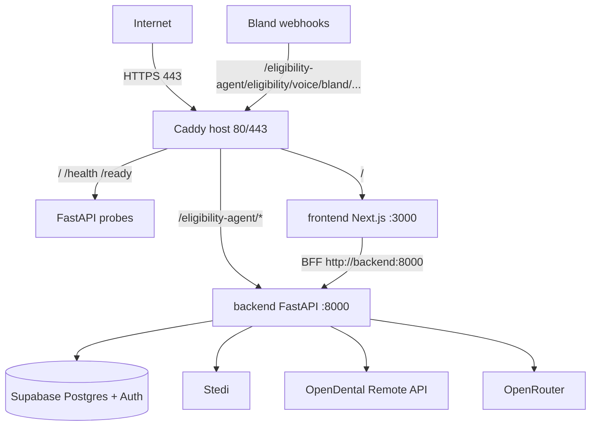
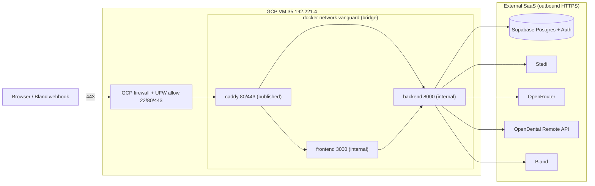

# Vanguard Production Deployment Runbook

**Target:** GCP Compute Engine Ubuntu VM · Static IP `35.192.221.4` · Domain `ezfi.smilesuite.ai`  
**Stack:** Docker Compose · Caddy (auto HTTPS) · FastAPI + Next.js dashboard · Supabase Postgres  
**Status:** Pilot infrastructure (synthetic / non-PHI data only until BAA plane is in place)

Companion product plan: [vanguard-production-execution-plan.md](../vanguard-production-execution-plan.md).

---

## Compliance gate (read before real patients)

| Item | Status |
|------|--------|
| Supabase Pro/Free BAA | **No** — not HIPAA-covered for PHI |
| VM processes PHI in memory | Yes (eligibility payloads, OD responses) |
| Approved for this deploy | **Synthetic / non-PHI pilot data only** |
| Live clinic + OD writeback with real patients | **Blocked** until PHI moves to a BAA-covered store (e.g. Neon Scale) and GCP BAA is accepted |

This is a go-live gate for real clinics, not a blocker for standing up the VM.

---

## Phase 0 — Repository audit

### Architecture (what ships)

| Piece | Path | Role |
|-------|------|------|
| FastAPI entry | [`main.py`](../../main.py) → [`app/main.py`](../../app/main.py) | Full app: auth, RCM, dashboard BFF APIs, pipeline worker, OD poller, voice |
| Eligibility sub-app | Mounted at `/eligibility-agent` | Stedi eligibility + voice webhooks |
| Backend image | [`Dockerfile`](../../Dockerfile) | Multi-stage Python 3.12, non-root `app`, `/health` HEALTHCHECK |
| Dashboard image | [`eligibility_dashboard/Dockerfile`](../../eligibility_dashboard/Dockerfile) | Next.js standalone on Node 22 |
| Local compose | [`docker-compose.yml`](../../docker-compose.yml) | Dev: publishes `:8000` and `:3000` |
| Prod compose | [`docker-compose.prod.yml`](../../docker-compose.prod.yml) | Prod: internal network + Caddy on 80/443 |
| Env contract | [`.env.example`](../../.env.example), [`deploy/.env.production.example`](../../deploy/.env.production.example) | Secrets + prod guards |
| Prod guards | [`app/startup_guards.py`](../../app/startup_guards.py) | Fail-fast when `ENVIRONMENT=production` |

### Current deployment strategy

- App is already Dockerized; local compose is for developer machines.
- Production uses **`docker-compose.prod.yml`** so backend/frontend are **not** published on the host; only Caddy is public.
- Data: `DATABASE_URL` → Supabase Postgres (alias of `NEON_DATABASE_URL` in settings).
- Dashboard reaches FastAPI server-side via `FASTAPI_BASE_URL=http://backend:8000` ([`fastapiProxy.ts`](../../eligibility_dashboard/src/lib/bff/fastapiProxy.ts)).

### Missing pieces addressed by this runbook

- Reverse proxy + TLS
- Host firewall / SSH hardening
- Production env templates with exact guard values
- DNS / domain cutover
- Ops: monitoring, backup, rollback

### Potential issues (carry forward)

1. Dev compose publishes `0.0.0.0:8000/3000` — never use that file on a public VM.
2. `ENVIRONMENT=production` requires auth, RBAC, DB, pipeline worker, eligibility API key (and Bland vars when voice is on).
3. SSE stream (`/api/dashboard/eligibility/stream`) must not be buffered — Caddy default is stream-safe; Next.js owns that path.
4. Multi-clinic OD keys: one env var per clinic (`OD_CUSTOMER_KEY_<SLUG>`), never in the DB.

**Checkpoint:** audit complete — proceed to Phase 1.

---

## Phase 1 — Infrastructure inventory

| Item | Tier | Recommendation |
|------|------|----------------|
| GCP Compute Engine VM (Ubuntu LTS) | Required | `e2-standard-2` (2 vCPU / 8 GB) minimum for spaCy `en_core_web_lg` + Next.js; `e2-medium` only if you switch to `en_core_web_sm` |
| Boot disk | Required | 40–50 GB SSD |
| Static external IP | Required | `35.192.221.4` (already assigned) |
| Domain | Required | `ezfi.smilesuite.ai` → A record to static IP |
| GCP VPC firewall | Required | Allow `tcp:22,80,443` only (optionally restrict SSH source IP) |
| Host UFW + Fail2Ban | Required | Installed by [`scripts/deploy/vm-setup.sh`](../../scripts/deploy/vm-setup.sh) |
| Docker Engine + Compose plugin | Required | Via vm-setup |
| Caddy | Required | Compose service; auto Let's Encrypt |
| Supabase project | Required | Postgres + Auth + service role / JWT secret |
| Stedi API key | Required | Eligibility 270/271 |
| OpenRouter API key | Required | LLM |
| OpenDental Developer + Customer keys | Required for OD | Remote API |
| Bland API + pathway | Required (this pilot) | Voice verification |
| GCP BAA | Recommended | Accept before any real PHI |
| Sentry DSN | Recommended | Error tracking |
| Weekly VM snapshot | Recommended | Disaster recovery |
| Swap (2G) | Optional | Small VMs |
| Subdomains (`api.`, `dashboard.`, `docs.`) | Optional | Future; not needed now |

### Rough monthly cost (pilot)

| Component | Estimate |
|-----------|----------|
| e2-standard-2 + 50 GB disk + static IP | ~$50–70 |
| Supabase Pro | ~$25 |
| OpenDental Customer Key | ~$30 / clinic |
| Stedi / OpenRouter / Bland | usage-based |
| **Total ballpark** | **~$100–200 / mo** + usage |

**Checkpoint:** inventory accepted — proceed to Phase 2.

---

## Phase 2 — Production readiness review

| Area | Rating | Notes |
|------|--------|-------|
| Backend Dockerfile | Production ready | Multi-stage, non-root, healthcheck, spaCy model |
| Frontend Dockerfile | Production ready | Standalone Next.js, non-root, healthcheck |
| Dev compose port publish | Must fix (for prod) | Use `docker-compose.prod.yml` (no host ports on app services) |
| Prod compose | Production ready | Internal network + Caddy only |
| Health `/health` | Production ready | Liveness |
| Readiness `/ready` | Production ready | Postgres check |
| Restart policy | Production ready | `unless-stopped` |
| Logging | Needs improvement → addressed | json-file rotation in prod compose |
| Secrets | Needs improvement → addressed | `deploy/.env.production` gitignored |
| Resource limits | Needs improvement → addressed | Memory limits in prod compose |
| Auth / RBAC guards | Production ready | Fail-fast in `startup_guards.py` |
| Pipeline worker | Production ready | Required when `ENVIRONMENT=production` |
| SSE / reverse proxy | Needs improvement → addressed | Path-based Caddy; no buffering on default proxy |
| PHI plane | Must fix before real clinics | Supabase-only is non-BAA |

**Checkpoint:** findings accepted — proceed to architecture.

---

## Phase 3 — Deployment architecture



### Network topology & trust boundaries



### Request lifecycle

1. Browser → `https://ezfi.smilesuite.ai/` → Caddy → `frontend:3000` (dashboard).
2. Dashboard server (BFF) → `http://backend:8000/...` on the Docker network (JWT / `X-API-Key`).
3. Bland → `https://ezfi.smilesuite.ai/eligibility-agent/eligibility/voice/bland/{id}` → Caddy → `backend:8000` (path preserved).
4. Backend → Supabase / Stedi / OpenDental / OpenRouter / Bland outbound over HTTPS.

### Ports and security boundaries

| Port | Bound on | Public? |
|------|----------|---------|
| 22 | Host (SSH) | Yes (restrict source IP if possible) |
| 80 / 443 | Caddy container | Yes |
| 8000 | Backend container only | No |
| 3000 | Frontend container only | No |

**Checkpoint:** architecture accepted.

---

## Phase 4 — VM preparation

Static IP: `35.192.221.4`. SSH public key should already be on the instance.

```bash
# From your laptop
ssh USER@35.192.221.4

# On the VM — after cloning or copying the repo
sudo bash scripts/deploy/vm-setup.sh
# re-login so docker group applies
exit
ssh USER@35.192.221.4
docker version
```

### What the script does (purpose / expected / recovery)

| Step | Purpose | Expected | If it fails |
|------|---------|----------|-------------|
| apt update/upgrade | Patch OS | Packages refresh | Retry; check network / apt mirrors |
| Base packages | git, ufw, fail2ban, jq | Installed | Fix apt; re-run script |
| Timezone | Consistent logs | `timedatectl` shows America/New_York (override via `VANGUARD_TIMEZONE`) | Set manually |
| Docker Engine | Runtime | `docker --version` works | Remove half-install; re-run; check Docker apt repo |
| docker group | Non-root docker | User in `docker` group | `sudo usermod -aG docker $USER` + re-login |
| UFW | Host firewall | 22/80/443 allow | `sudo ufw status`; do not lock yourself out of SSH |
| Fail2Ban | Brute-force protection | `systemctl is-active fail2ban` | Check `/var/log/fail2ban.log` |
| Unattended upgrades | Auto security patches | Config file present | Reinstall `unattended-upgrades` |
| `/opt/vanguard` | App root | Owned by deploy user | `sudo mkdir -p /opt/vanguard && sudo chown $USER` |
| Swap | Build/runtime headroom on small VMs | 2G `/swapfile` active + in `/etc/fstab` (size via `VANGUARD_SWAP_SIZE`) | `swapon --show`; recreate `/swapfile` if missing |

Also create a GCP firewall rule allowing `tcp:22,80,443` to this VM (VPC → Firewall). Prefer restricting SSH to your office/home IP.

**Checkpoint:** VM prepared; Docker works without sudo after re-login.

---

## Phase 5 — Environment variables

Templates (copy on the VM; never commit the filled files):

- Backend: [`deploy/.env.production.example`](../../deploy/.env.production.example) → `deploy/.env.production`
- Dashboard: [`deploy/dashboard.env.production.example`](../../deploy/dashboard.env.production.example) → `deploy/dashboard.env.production`

### Groups

| Group | Examples | In Git? |
|-------|----------|---------|
| Application / guards | `ENVIRONMENT`, `REQUIRE_AUTH`, `REQUIRE_RBAC`, `PIPELINE_WORKER_ENABLED` | Example only |
| Database | `DATABASE_URL` | Never (secret) |
| Supabase | `SUPABASE_URL`, service role, anon, JWT secret | Never (keys) |
| Auth | `INTERNAL_API_KEYS`, `ELIGIBILITY_AGENT_API_KEY` | Never |
| External APIs | Stedi, OpenRouter, Bland, OD keys | Never |
| Provider identity | `PROVIDER_NPI`, `PROVIDER_NAME`, `PROVIDER_TAX_ID` | Example only |
| Dashboard public | `NEXT_PUBLIC_SUPABASE_*` | Example only (anon key is publishable but still not committed here) |
| Dashboard server | `RCM_API_KEY`, `DASHBOARD_PRACTICE_ID` | Never |

### Production fail-fast checklist

When `ENVIRONMENT=production`, the API will **not start** unless:

- `REQUIRE_AUTH=1`
- `REQUIRE_RBAC=1`
- `DATABASE_URL` (or `NEON_DATABASE_URL`) set
- `PIPELINE_WORKER_ENABLED=1`
- `ELIGIBILITY_AGENT_API_KEY` set
- If Stedi or voice is enabled: real `PROVIDER_NPI`, `PROVIDER_NAME`, and `PROVIDER_TAX_ID`
- If voice on + Bland: `BLAND_API_KEY` + `VOICE_WEBHOOK_BASE_URL`

`RCM_API_KEY` (dashboard) must equal one value in `INTERNAL_API_KEYS` (backend).

Generate secrets:

```bash
openssl rand -hex 32   # INTERNAL_API_KEYS / RCM_API_KEY / ELIGIBILITY_AGENT_API_KEY
```

**Checkpoint:** no secrets in Git; both env files filled on the VM.

---

## Phase 6 — Docker review

| Topic | Prod choice |
|-------|-------------|
| Compose file | `docker-compose.prod.yml` only on the VM |
| Networks | Single bridge `vanguard` |
| Volumes | `caddy_data`, `caddy_config` (certs/state; access logs go to stdout) |
| Healthchecks | Backend `/health`, frontend HTTP, Caddy depends on both healthy |
| Restart | `unless-stopped` |
| Resource limits | Backend 2G, frontend 1G, Caddy 256M |
| Naming | `vanguard-backend`, `vanguard-frontend`, `vanguard-caddy` |
| Logging | json-file, 10m × 5 files |
| Host ports | Only Caddy 80/443 (and 443/udp for HTTP/3) |

Local `docker-compose.yml` remains for developers.

**Checkpoint:** prod compose reviewed.

---

## Phase 7 — Domain & DNS

**Provider:** wherever `smilesuite.ai` is hosted (Cloud DNS / Cloudflare / registrar).

| Type | Name | Value | TTL | Why |
|------|------|-------|-----|-----|
| A | `ezfi` (→ `ezfi.smilesuite.ai`) | `35.192.221.4` | 300 during cutover, then 3600 | Primary app hostname |
| AAAA | — | — | — | Skip unless the VM has IPv6 |
| CNAME | — | — | — | Not needed for apex subdomain with A |
| TXT | optional | ACME/DNS challenge only if you leave HTTP challenge | — | Caddy uses HTTP-01 by default (needs 80 open) |

### Traffic path

`Browser → DNS A → 35.192.221.4:443 → Caddy → frontend or backend`

### Propagation / migration

- Low TTL (300) before cutover; raise after validation.
- Future: `api.ezfi.smilesuite.ai` / `dashboard.ezfi.smilesuite.ai` can be additional Caddy site blocks; path-based routing already covers pilot needs.
- Moving hosts later: change the A record; keep Caddyfile hostnames in sync.

Verify:

```bash
dig +short ezfi.smilesuite.ai
# expect: 35.192.221.4
```

**Checkpoint:** A record live before `docker compose up` (Caddy needs a resolvable name for Let's Encrypt).

---

## Phase 8 — Reverse proxy (Caddy)

Config: [`deploy/Caddyfile`](../../deploy/Caddyfile).

| Directive | Purpose |
|-----------|---------|
| Site `ezfi.smilesuite.ai` | Automatic HTTPS for this hostname |
| `encode gzip zstd` | Compression |
| `header { ... }` | HSTS, nosniff, frame deny, referrer, permissions |
| `log` | JSON access log to **stdout** (captured + rotated by the Docker json-file driver) |
| `handle /health` / `/ready` | Uptime probes → backend |
| `handle /eligibility-agent/*` | Eligibility + voice → backend (**path preserved**) |
| `handle` (default) | Dashboard → frontend |

Do **not** switch to `handle_path` for `/eligibility-agent` — that would strip the prefix and break the FastAPI mount.

**Checkpoint:** Caddyfile understood.

---

## Phase 9 — HTTPS

Caddy obtains and renews Let's Encrypt certificates automatically (stored in the `caddy_data` volume).

| Topic | Detail |
|-------|--------|
| Lifecycle | Issue on first start → renew ~30 days before expiry |
| Renewal | Automatic inside the Caddy container |
| Failure recovery | Ensure DNS + ports 80/443; `docker logs vanguard-caddy`; `docker compose ... restart caddy` |
| HTTP → HTTPS | Caddy redirects automatically |

Verify after deploy:

```bash
curl -fsSI https://ezfi.smilesuite.ai/ | head
openssl s_client -connect ezfi.smilesuite.ai:443 -servername ezfi.smilesuite.ai </dev/null 2>/dev/null | openssl x509 -noout -dates -subject
```

**Checkpoint:** valid cert; HTTPS works.

---

## Phase 10 — Deployment

On the VM:

```bash
# 1) Clone (first time) or pull
sudo mkdir -p /opt/vanguard
sudo chown "$USER:$USER" /opt/vanguard
cd /opt/vanguard
git clone <REPO_URL> .
# or: git pull --ff-only

# 2) Env files
cp deploy/.env.production.example deploy/.env.production
cp deploy/dashboard.env.production.example deploy/dashboard.env.production
nano deploy/.env.production          # fill secrets
nano deploy/dashboard.env.production # fill secrets; RCM_API_KEY ∈ INTERNAL_API_KEYS

# 3) Schema migrations (from a machine with network access to Supabase)
# Prefer running once from CI or a laptop with venv, pointing at the same DATABASE_URL:
#   export DATABASE_URL='postgresql://...'
#   python scripts/apply_schema_migrations.py
# Seed platform.user_practice_roles for each staff user (REQUIRE_RBAC=1).

# 4) Build-arg interpolation for NEXT_PUBLIC_* then start
set -a && . ./deploy/dashboard.env.production && set +a
docker compose -f docker-compose.prod.yml up -d --build

# 5) Inspect
docker compose -f docker-compose.prod.yml ps
docker compose -f docker-compose.prod.yml logs -f --tail=100
```

### Verification before continuing

```bash
docker compose -f docker-compose.prod.yml ps
# all services healthy / running

docker exec vanguard-backend curl -fsS http://127.0.0.1:8000/health
# {"status":"ok"}

curl -fsS https://ezfi.smilesuite.ai/health
curl -fsS https://ezfi.smilesuite.ai/ready
# ready once DATABASE_URL is reachable

curl -fsSI https://ezfi.smilesuite.ai/ | head -n1
# HTTP/2 200 (dashboard)

curl -fsS -o /dev/null -w "%{http_code}\n" https://ezfi.smilesuite.ai/eligibility-agent/health
# 200 if the sub-app exposes /health, else 401/404 is still "reached FastAPI via Caddy"
```

**Stop here if health/ready fail.** Do not open the clinic until Phase 11 passes.

---

## Phase 11 — Validation report

| Check | How | Pass criteria |
|-------|-----|---------------|
| Docker services | `compose ps` | backend, frontend, caddy up; healthchecks green |
| `/health` | `curl https://ezfi.smilesuite.ai/health` | `{"status":"ok"}` |
| `/ready` | `curl https://ezfi.smilesuite.ai/ready` | `status: ready`, postgres ok |
| Dashboard UI | Browser `https://ezfi.smilesuite.ai/` | Login page / app shell loads |
| Staff auth | Login with Supabase user | Session established |
| RBAC | User has `platform.user_practice_roles` row | Nav + APIs authorize |
| BFF → API | Dashboard loads eligibility queue | No "Failed to load eligibility queue" from missing key |
| Eligibility path | Hit `/eligibility-agent/...` without Bearer | `401` (guard working) = PASS |
| SSE | Open eligibility page | Live updates or 30s poll fallback |
| OpenDental | Dashboard → Test connection | `ok` + covcats |
| Stedi | Submit sandbox/synthetic check | Request completes or clear error (not 503 misconfig) |
| Voice / Bland | Trigger voice session | Bland webhook reaches `/eligibility-agent/eligibility/voice/bland/...` |
| Logs | `docker logs vanguard-backend` | JSON logs; PHI scrubbed (`<PHI>`) |
| Ports | `ss -tlnp` / GCP firewall | Only 22/80/443 public |

Mark each **PASS / WARNING / FAIL**. Do not proceed to real-patient traffic on FAIL or on WARNING for auth/RBAC/TLS.

---

## Phase 12 — Security review

| Control | Recommendation |
|---------|----------------|
| SSH | Key-only; disable password auth; restrict source IP in GCP firewall |
| Fail2Ban | Enabled by vm-setup |
| UFW | 22/80/443 only |
| Docker | App containers not published; non-root inside images |
| Root | Prefer sudo user; avoid daily root SSH |
| Secrets | Only on VM disk (`deploy/.env.production*`); 600 perms: `chmod 600 deploy/.env.production deploy/dashboard.env.production` |
| Automatic updates | Unattended security upgrades on |
| Unused services | Do not install desktop stacks / extra daemons |
| Least privilege | Supabase service role only on backend; browser uses anon + staff JWT |
| Auth | `REQUIRE_AUTH=1`, `REQUIRE_RBAC=1`, `DASHBOARD_REQUIRE_AUTH=1` |
| Mocks | `ALLOW_CLAIM_MOCK_SUBMISSION=false` |

---

## Phase 13 — Monitoring (lightweight)

| Signal | How |
|--------|-----|
| Container status | `docker compose -f docker-compose.prod.yml ps` |
| App logs | `docker logs -f vanguard-backend` (JSON + correlation IDs) |
| Access logs | `docker logs -f vanguard-caddy` (Caddy access log JSON on stdout) |
| Disk / RAM / CPU | `df -h`, `free -h`, `htop` |
| Uptime | External probe `GET https://ezfi.smilesuite.ai/ready` every 1–5 min (UptimeRobot / Better Stack free tier) |
| Errors | Optional `SENTRY_DSN` |
| Log rotation | json-file `max-size`/`max-file` in compose (covers app, frontend, and Caddy stdout) |

Avoid Datadog/ELK unless pilot scale demands it.

---

## Phase 14 — Backup & disaster recovery

| Asset | Strategy | Owner |
|-------|----------|-------|
| Postgres | Supabase automatic backups / PITR (plan-dependent) | Supabase |
| Env files | Encrypted off-box copy (password manager or private GCS bucket) | Ops |
| Compose + Caddyfile | In Git | Engineering |
| Caddy certs | Recreated automatically; volume `caddy_data` optional snapshot | Caddy / GCP |
| VM | Weekly GCP disk snapshot | Ops |

### Targets (pilot)

| Metric | Target |
|--------|--------|
| RPO | ~24h (daily DB backup + env copy) |
| RTO | ~2–4h (new VM + snapshot/disk + `compose up` + DNS TTL) |

### Recovery sketch

1. Provision Ubuntu VM, attach static IP (or update DNS).
2. Run `vm-setup.sh`, clone repo, restore `deploy/.env.production*`.
3. `docker compose -f docker-compose.prod.yml up -d --build`.
4. Confirm `/ready` and login.
5. Test recovery annually (or before first real clinic).

---

## Phase 15 — Update & rollback workflow

```bash
cd /opt/vanguard
git fetch --ff-only origin
git checkout <tag-or-sha>

# Rebuild when Dockerfile, deps, or Next public env change:
set -a && . ./deploy/dashboard.env.production && set +a
docker compose -f docker-compose.prod.yml up -d --build

# Restart-only when only env values change:
# edit deploy/.env.production
docker compose -f docker-compose.prod.yml up -d --force-recreate backend

# Smoke
curl -fsS https://ezfi.smilesuite.ai/health
curl -fsS https://ezfi.smilesuite.ai/ready
```

| Change type | Action |
|-------------|--------|
| App Python/TS code | `up -d --build` |
| `NEXT_PUBLIC_*` | Rebuild frontend (build args) |
| Backend secrets only | Recreate backend container |
| Caddyfile only | `docker compose ... exec caddy caddy reload --config /etc/caddy/Caddyfile` or recreate caddy |

### Rollback

```bash
git checkout <previous-good-sha>
set -a && . ./deploy/dashboard.env.production && set +a
docker compose -f docker-compose.prod.yml up -d --build
```

Keep previous image tags if you retag releases (`vanguard-md/backend:prod` is mutable — prefer tagging `:prod-YYYYMMDD` before risky deploys if you need instant image rollback without rebuild).

---

## Troubleshooting

| Symptom | Likely cause | Fix |
|---------|--------------|-----|
| Backend exits immediately | Prod guard missing env | `docker logs vanguard-backend`; fill required vars |
| `/ready` 503 | Bad `DATABASE_URL` / network | Check pooler URI, password, Supabase allow list |
| Dashboard buttons dead | Opened via `127.0.0.1` in local dev | Use `localhost` locally; prod uses domain |
| 401 on all BFF calls | `RCM_API_KEY` ≠ `INTERNAL_API_KEYS` | Align keys |
| Caddy cert fail | DNS not pointing / port 80 blocked | Fix A record + GCP firewall + UFW |
| Voice never completes | Wrong `VOICE_WEBHOOK_BASE_URL` | Must be `https://ezfi.smilesuite.ai/eligibility-agent` |
| SSE stuck | Proxy buffering (non-Caddy) | Stay on Caddy; check Next BFF stream route |
| Out of memory | spaCy lg + build | Raise VM RAM or rebuild backend with `en_core_web_sm` |

---

## Production deployment checklist

- [ ] GCP BAA accepted (before real PHI)
- [ ] Compliance gate understood (synthetic data for Supabase-only pilot)
- [ ] VM created; static IP `35.192.221.4`; SSH key auth
- [ ] GCP firewall: 22/80/443 only
- [ ] `scripts/deploy/vm-setup.sh` completed; docker group active
- [ ] DNS A `ezfi.smilesuite.ai` → `35.192.221.4`
- [ ] `deploy/.env.production` filled; `chmod 600`
- [ ] `deploy/dashboard.env.production` filled; `RCM_API_KEY` matches `INTERNAL_API_KEYS`
- [ ] Schema migrations applied; `user_practice_roles` seeded
- [ ] `docker compose -f docker-compose.prod.yml up -d --build`
- [ ] `/health` and `/ready` PASS
- [ ] HTTPS cert valid
- [ ] Dashboard login + RBAC PASS
- [ ] OD test connection (if used) PASS
- [ ] Bland webhook path reachable (if voice on)
- [ ] Uptime probe configured
- [ ] Env backup stored off-box
- [ ] Weekly VM snapshot scheduled

---

## File index

| File | Purpose |
|------|---------|
| [`docker-compose.prod.yml`](../../docker-compose.prod.yml) | Production services |
| [`deploy/Caddyfile`](../../deploy/Caddyfile) | Reverse proxy + TLS |
| [`deploy/.env.production.example`](../../deploy/.env.production.example) | Backend env template |
| [`deploy/dashboard.env.production.example`](../../deploy/dashboard.env.production.example) | Dashboard env template |
| [`scripts/deploy/vm-setup.sh`](../../scripts/deploy/vm-setup.sh) | Ubuntu host prep |
