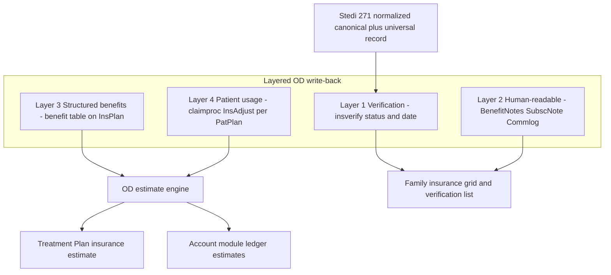

# Open Dental Eligibility-to-Ledger Write-Back Architecture

**Status:** Active (June 2026)  
**Audience:** Engineering, product, pilot operations, demo prep  
**Companion:** [opendental-integration.md](opendental-integration.md), [vanguard-production-execution-plan.md](vanguard-production-execution-plan.md)

---

## A. Executive Summary

The objective is not "write a note." It is to make Stedi eligibility findings flow into the **same native Open Dental objects that real billers and treatment coordinators already read**: the Family-module insurance grid, the Insurance Plan benefit table, the Treatment Plan estimate, and the Account module ledger estimates.

The correct source-of-truth for everything financial in OD is the **`benefit` table on the Insurance Plan**. OD's estimate engine computes per-procedure insurance portion and patient responsibility from `benefit` rows + fee schedule. If we populate benefits correctly, accurate estimates appear everywhere natively, with zero fake transactions.

We must NOT use `adjustment`, `payment`, or fabricated `procedurelog` rows to represent eligibility — those corrupt accounts-receivable accounting. Patient-specific consumption (deductible met, annual-max used) belongs in `claimproc InsAdjust` (a benefit-usage adjuster, not an AR adjustment) scoped per `PatPlan`.

Current code already implements the "human-visible" layer (notes + verification + commlog) on the cheap **$15** API tier and a gated structured benefit-grid writer on the **$30** tier. The gap to production is:

1. Parse frequency / waiting / missing-tooth from the 271
2. Harden the benefit-grid writer for shared-plan safety
3. Add idempotent per-patient usage sync

**Recommendation:** ship a **layered write-back** (verification → human-readable → structured benefits → patient usage), each flag-gated and fault-isolated. The demo runs layers 1–2 (already done, visible immediately); production turns on layers 3–4 once the $30 Insurance tier is enabled and data gaps are closed.

---

## B. Open Dental Ledger / Account Architecture Analysis

What a user actually sees is assembled from these native objects:

| Object | Role | Eligibility relevance |
|--------|------|----------------------|
| `procedurelog` | Procedures (TP or completed); drives Treatment Plan and ledger procedure lines | Do **not** fabricate for eligibility |
| `claim` + `claimproc` | Claims and per-procedure insurance estimates (`InsPayEst`, `DedEst`, `WriteOff`) | TP/Estimate `claimproc` rows show "Ins Est" and "Pat" columns; `InsAdjust` records benefit usage |
| `insplan` + `benefit` | Plan definition: coverage %, deductibles, annual max, frequencies, waiting periods | **Primary leverage point** — engine input for all estimates; shared by every subscriber on the plan |
| `patplan` / `inssub` | Patient-to-plan link; `BenefitNotes` / `SubscNote` free-text | Notes have no estimate effect; `InsAdjust` per `PatPlan` records YTD usage |
| `insverify` | Verification status + date | Insurance Verification List + "Benefits last verified" in plan UI |
| `commlog` | Patient communication log | Front-desk visibility for eligibility summaries |
| `adjustment` / `payment` / `paysplit` / `claimpayment` | Real money on AR ledger | **Off-limits for eligibility** |

### Key architectural truths

1. **Estimates are computed, not stored as truth.** OD derives them from `benefit` + fee schedule + `claimproc InsAdjust` usage. The leverage point is `benefit`, not per-claim overrides.
2. **`benefit` lives on `insplan` and is shared.** Mutating it changes estimates for every patient on that plan — exactly how OD's own "Import Benefits from 271" / Trojan import behaves.
3. **Remaining annual max / deductible met are patient-specific.** They do not live on `benefit`; they are tracked via claim history and `claimproc InsAdjust`.

---

## C. Eligibility-to-Ledger Mapping Matrix

Pipeline source fields: `app/eligibility/canonical_model.py`, `app/eligibility/universal_dental/models.py`.

| Field staff need | Stedi / canonical source | Open Dental target | Status |
|------------------|--------------------------|-------------------|--------|
| Eligibility status | `canonical.is_active` / routing status | `insverify` + `inssub.SubscNote` + `benefit ActiveCoverage` | Available now |
| Annual maximum | `canonical.max_total` / `financial.annual_max` | `benefit Limitations`, CovCat=General, MonetaryAmt | Available (grid writer) |
| Remaining annual max | `canonical.max_remaining` | `claimproc InsAdjust` (insUsed = total − remaining) per `PatPlan` | Built; needs idempotent set |
| Deductible | `canonical.deductible_total` | `benefit Deductible`, CovCat=General | Available now |
| Remaining deductible | `canonical.deductible_remaining` | `claimproc InsAdjust` (deductibleUsed = total − remaining) | Built; needs idempotent set |
| Preventive coverage % | `categories[PREVENTIVE].coinsurance_patient_pct` | `benefit CoInsurance`, CovCat=Diagnostic/Preventive | Available now |
| Basic coverage % | `categories[BASIC]` | `benefit CoInsurance` on Restorative/Endo/Perio/OralSurgery/Adjunctive | Available now |
| Major coverage % | `categories[MAJOR]` | `benefit CoInsurance` on Crowns/Prosth/MaxProsth | Available now |
| Frequency limitations | 271 EB segments + service delivery + quantity | `benefit Limitations` with QuantityQualifier | **Parsed** → `dental_benefit_breakdown.frequency_limitations` |
| Waiting periods | 271 limitation text + procedure details | `benefit WaitingPeriod` per CovCat | **Parsed** → `dental_benefit_breakdown.waiting_periods` |
| Missing tooth clause | 271 exclusion text | `benefit Exclusions` row + `BenefitNotes` line | **Detected** → `dental_benefit_breakdown.missing_tooth_clause` |

Anything we cannot reliably parse is rendered `n/a` in notes and simply not written to `benefit` — never fabricated.

---

## D. Recommended Vanguard Architecture

A layered, additive write-back. Each layer is independently flag-gated and fault-isolated (`run_opendental_writeback` pattern).

### Layers

| Layer | Objects | API tier | Default | Effect |
|-------|---------|----------|---------|--------|
| **1 — Verification** | `insverify` | $15 | On | Last-verified date; coordinators trust data is fresh |
| **2 — Human-readable** | `BenefitNotes`, `SubscNote`, `commlog` | $15 | On | Demo win — snapshot where staff already look |
| **3 — Structured benefits** | `benefit` upsert on `insplan` | $30 | Off | Drives native insurance estimates in TP + Account |
| **4 — Patient usage** | `claimproc InsAdjust` per `PatPlan` | $15 | Off | Remaining max / deductible met reflected in estimates |

**Never:** `adjustment`, `payment`, fake `procedurelog`.

### Demo vs Production vs Enterprise

| Tier | Scope | Complexity | Effort | Risk | UX impact |
|------|-------|------------|--------|------|-----------|
| **Demo** | Layers 1–2 | Low | ~0 (built) | Minimal (no estimate mutation) | Verified status + bold-red grid note + readable snapshot; does not change estimates |
| **Production** | + Layers 3–4 | Medium-high | ~2–3 wk | Shared-plan mutation, clobbering manual edits, payer accuracy, $30 tier required | Accurate native insurance estimates — real biller workflow |
| **Enterprise** | + overrides, provenance, DLQ, multi-clinic audit | High | Multi-month | Data governance, fighting human billers | Full RCM-grade reconciliation |

### How major RCM vendors surface eligibility

Trojan Benefit Service, Vyne/DentalXChange, Zuub, Pearly, and Overjet all converge on the same pattern: **import a structured benefit breakdown into the PMS benefit table** so the PMS's own estimate engine produces patient portions, plus attach a human-readable benefit sheet/verification. OD ships a native Trojan/271 benefit import. Our Layer 3 is the same play via the API.

---

## E. MVP Implementation Plan

1. **Demo path** — Layers 1–2 already live; verify end-to-end on a sandbox patient (notes + SubscNote + insverify + commlog).
2. **Close data gaps** in normalizer / universal record:
   - Parse frequency limitations from 271 EB segments (CovCat/CDT, quantity, qualifier, period)
   - Parse waiting periods into per-category months (replace boolean-only `waiting_periods_present`)
   - Detect missing-tooth-clause language → Exclusions row + note line
3. **Extend benefit-grid writer** — emit `Limitations` (frequency), `WaitingPeriod`, and `Exclusions` rows in addition to CoInsurance/Deductible/AnnualMax.
4. **Shared-plan safety** — provenance tag on agent-written rows, change-detection, guard that skips rows last edited by a human.
5. **Idempotent InsAdjust** — set used = total − remaining for the period, never additive; opt-in per clinic.
6. **Demo script** — extend `scripts/demo_opendental_eligibility.py` to run a sandbox PatNum through all four layers.

---

## F. Production Roadmap

- Enable the **$30** OD "Insurance" API tier per clinic customer key (Layers 3–4 return 401 without it).
- **Shadow mode first** (Phase 6 of execution plan): poller read-only, write Layers 1–2 only, compare Layer 3/4 proposed benefits against biller's manual entries.
- Turn on Layer 3 with manual-edit protection; then Layer 4 once usage sync is validated.
- Write-back retry queue / DLQ: never drop a benefit write; exponential backoff; Sentry alert on DLQ growth.
- Audit every benefit mutation (before/after, source check_id, agent version) into PHI-plane `audit_logs`.
- Per-payer accuracy tuning of Layer-3 normalizer before broad rollout.

---

## G. API Endpoints, Tables, and Write-Back Sequence

Per-patient sequence (each step flag-gated + try/except):

| Step | Endpoint | Table / field | Layer |
|------|----------|---------------|-------|
| 1 | `PUT /insverifies` (PatientEnrollment + InsuranceBenefit) | `insverify` | 1 |
| 2 | `PUT /inssubs/{InsSubNum}` BenefitNotes | `inssub.BenefitNotes` | 2 |
| 3 | `PUT /inssubs/{InsSubNum}` SubscNote | `inssub.SubscNote` | 2 |
| 4 | `POST /commlogs` | `commlog` | 2 |
| 5 | `GET /covcats` | resolve EbenefitCat → CovCatNum | 3 |
| 6 | `GET /benefits?PlanNum=` | existing rows for idempotent upsert | 3 |
| 7 | `POST` / `PUT /benefits/{BenefitNum}` | `benefit` rows (CoInsurance, Deductible, Limitations, WaitingPeriod, Exclusions) | 3 |
| 8 | `PUT /claimprocs/InsAdjust` | `claimproc` usage per PatPlan | 4 |

**Auth:** `Authorization: ODFHIR {DeveloperKey}/{CustomerKey}`

**API tiers:** GET free; **$15** covers steps 1–4 and 8; **$30** (Insurance group) required for steps 5–7.

### Code touchpoints

| File | Role |
|------|------|
| `app/integrations/opendental/writeback.py` | Format + orchestrate all write-back layers |
| `app/integrations/opendental/client.py` | REST client methods |
| `app/integrations/opendental/models.py` | Pydantic payloads |
| `app/eligibility/main.py` | `run_from_opendental()` entry point |
| `app/eligibility/config.py` | Feature flags (`OPENDENTAL_WRITE_*`) |
| `app/eligibility/normalizer.py` | 271 → canonical (data gaps to close) |
| `app/eligibility/universal_dental/build.py` | Canonical → universal dental record |

### Config flags

| Flag | Default | Layer |
|------|---------|-------|
| `OPENDENTAL_WRITEBACK_ENABLED` | false | Master gate |
| `OPENDENTAL_WRITE_BENEFIT_NOTES_ENABLED` | true | 2 |
| `OPENDENTAL_WRITE_SUBSCRIBER_NOTE_ENABLED` | true | 2 |
| `OPENDENTAL_WRITE_COMMLOG_ENABLED` | true | 2 |
| `OPENDENTAL_WRITE_BENEFITS_GRID_ENABLED` | false | 3 |
| `OPENDENTAL_WRITE_INSADJUST_ENABLED` | false | 4 |
| `OPENDENTAL_AUTO_POLL_ENABLED` | false | Automation |
