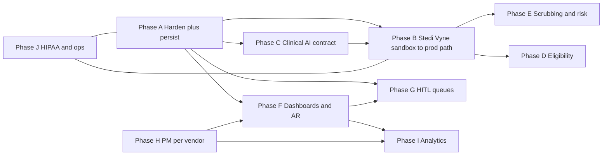

# Production roadmap — hardened platform and full feature set

This document is the executable roadmap to move the current **FastAPI + Supabase + agent pipelines** stack toward a **production-ready** revenue-cycle platform, including the capabilities discussed in product planning (eligibility, scrubbing, dashboards, HITL at scale, PM integration, analytics).

**Assumptions baked in:**

- **Clinical AI** is the primary source of clinical input; this platform **ingests, validates, enforces policy, integrates with clearinghouses, tracks money and denials**, and provides **human-in-the-loop** and **analytics**. You do not need to replace the EHR on day one if the clinical AI is the clinical front door.
- **Stedi** and **Vyne** are first-class clearinghouses; **sandbox APIs are already available** — production work is adapter implementation, persistence, ack/ERA loops, and dual-vendor routing.
- **Production-ready** means durable persistence, authz, observability, replayable pipelines, contractual HIPAA posture, and **no silent data loss** — not “every ML feature on day one.”

---

## 0. North star

- One internal **claim / remittance / task** model.
- One **`ClearinghouseClient`** abstraction with `Mock`, `Stedi`, and `Vyne` implementations.
- One **versioned clinical ingest contract** from the clinical AI.
- All money-moving steps **audited** and **idempotent**.

---

## Phase A — Harden what exists (foundation, ~4–8 weeks, parallelizable)

### A1. Architecture and code health

- Define a **`ClearinghouseClient` protocol**: submit claim, poll status, fetch 277/835 (and eligibility if exposed by the vendor). Replace `submit_claim_tool` mock internals with real HTTP when keys + environment indicate sandbox or prod (`app/tools/claim_tools.py` today is mock-shaped).
- **Single orchestration contract** for pipeline runs: align `run_full_rcm_pipeline` (coding → prior auth → claim draft) with dashboard and persistence via a **`PipelineRun`** (or equivalent) record: stages, input snapshot hash, per-stage outputs, correlation IDs for Stedi/Vyne.
- **CI**: ruff + pytest on every PR; optional mypy on `app/`. Merge blocked on red CI.
- **Configuration**: documented env schema; secrets only via secret manager / env; separate **dev / sandbox / prod** profiles.

### A2. Persistence (non-negotiable for production)

- Replace **in-memory** dashboard claim store with **Supabase/Postgres** tables such as: `pipeline_runs`, `claims`, `claim_versions`, `eras`, `denial_cases`, `tasks` (HITL). Keep in-memory only for local demos if needed.
- **Idempotency** on submit and webhooks: idempotency keys so retries never double-submit.

### A3. Observability and operations

- Structured logging: request id, encounter id, claim id, clearinghouse transaction id.
- Error tracking (e.g. Sentry) on FastAPI.
- Correlate LLM calls (OpenRouter or direct) and external HTTP (Stedi/Vyne) with one **trace/correlation id**.

**Data for Phase A:** Minimal — schemas and a few **golden JSON fixtures** per pipeline stage for regression tests.

---

## Phase B — Clearinghouse reality: Stedi + Vyne (~6–12 weeks, overlaps A)

### B1. Sandbox “definition of done”

- Generate **837D** (or the transaction set you standardize on) from the **internal claim model**; map to each vendor’s API or payload format; successful **round-trip in both sandboxes**.
- Ingest **acknowledgments / status** (e.g. 277/999 or vendor equivalents); store **raw + parsed** summary on `claims`.
- Ingest **835 ERA** in sandbox; link to internal `claim_id`; drive **denial workflow** from stored ERA, not only in-request `mock_era`.

### B2. Dual-vendor strategy

- **Routing rules** in DB: by payer, practice, or explicit configuration — not hardcoded branches everywhere.
- **Normalization**: internal enums (`ClaimSubmissionStatus`, `EraNormalized`, denial reason buckets) so denial and UI logic are not forked per vendor.

**Data for Phase B:** Pilot payer list; **sandbox member / subscriber test data** per vendor docs; library of **sample 835** files keyed by denial scenario (CO-16, CO-50, PR-96, etc.).

---

## Phase C — Clinical AI integration (~4–8 weeks, can start early)

### C1. Contract (API + schema)

- Versioned ingest (REST or webhook), e.g. **`ClinicalAiEncounterIngest`**: `encounter_id`, `clinical_note`, optional structured codes, **provenance** (model id, prompt/version), `attachments[]`, demographics hints, `practice_id`.
- **Validation and audit**: store AI proposal vs system-final coding on decisions or sibling tables; never overwrite without versioned history.

### C2. Safety and limits

- Per-practice rate limits; payload size limits; if storing files, Supabase Storage with scanning and strict RLS.

**Data for Phase C:** Agreement on **source of truth** for demographics; required-field checklist before claim build; **synthetic** payloads for automated tests (no PHI in CI).

---

## Phase D — Eligibility and benefits (~8–16 weeks, payer-dependent)

### D1. Transactional eligibility

- **270/271** (or Stedi/Vyne eligibility products if they abstract X12); cache with **TTL**; full audit (who requested, when, for which patient/encounter).

### D2. Benefits in the product

- Parse 271 into a **benefits snapshot** model: start with **display + eligibility flags** for prior auth and claim blockers; expand to deductible/max/frequency where data exists.

### D3. Payer portals

- Treat **manual portal steps** as **tasks** in the HITL queue when API path is insufficient; log SLA and resolution.

**Data for Phase D:** Trading partner IDs; payer → **eligibility channel** mapping (Stedi vs Vyne vs manual); **271 test scenarios** from clearinghouse documentation.

---

## Phase E — Claim scrubbing and denial prediction (tiered)

### E1. Production without ML (~4–8 weeks) — ship this first

- **Pre-submit scrub**: NPI, taxonomy, POS, diagnosis pointers, CDT/ICD consistency, PA number when required, attachment requirements — plus any **synchronous clearinghouse edits** returned before acceptance.
- **Post-submit**: parse 277 (or equivalent); create **tasks** for billers on rejections.

### E2. Prediction v1 — rules + LLM, not ML

- Unified **`claim_risk_score`** on draft from: PA required, coding confidence, payer flags, missing attachments — consolidate logic already spread across coding and prior auth.

### E3. ML when data exists (~3–6+ months after E1)

- Train **denial risk** and **scrub assist** on **your** labeled 835 + human resolutions; requires a **warehouse** or nightly export and strict PHI governance.

**Data for Phase E:** Large set of **labeled** outcomes (submitted → paid/denied + reason code); optional feature store; de-identified training pipeline if not on BAA-covered analytics infra.

---

## Phase F — Clinic dashboards: outstanding claims, AR aging, productivity (~8–14 weeks after persistence)

### F1. AR aging

- Requires **balances** at claim or line level: from **835 rollups + adjustments**, and/or **PM ledger** import. Define v1 scope: “835-based partial AR” vs “full ledger.”

### F2. Staff productivity

- Metrics from **`tasks`** and audit log: completed tasks, time-in-status, appeals authored — not from claims alone.

**Data for Phase F:** If no PM in pilot: **CSV/import** for charges/payments or controlled synthetic ledger; long-term PM sync or full posting model.

---

## Phase G — Scalable human-in-the-loop (~6–12 weeks, overlaps F)

- **Queues**: coding review, PA documentation, claim correction, appeal — with assignment, priority, due dates, links to encounter/claim.
- **RBAC** and **Supabase RLS** scoped by `practice_id`.
- **SLA** metrics: backlog age, breaches.

**Data for Phase G:** Role matrix (reviewer, biller, admin); immutable audit on every state change.

---

## Phase H — EHR/PM integration (Open Dental, Dentrix, Denticon, Ascend)

- **Per vendor** this is typically **3–9 months**: auth, read patients/appointments/charges, write claim status — separate mini-roadmap each; shared only **internal IDs** and your claim model.
- Can run **after** a narrow pilot: clinical AI + Stedi/Vyne + your DB + CSV/limited demographics.

**Data for Phase H:** Vendor API credentials, certification requirements, field-mapping workbooks, test practices.

---

## Phase I — Analytics and reporting (ongoing, ~4+ weeks after F)

- **Revenue leakage**: needs fee schedules, allowed amounts (835 or contracts), write-offs — v1 can be **denial dollars by reason** if full leakage is too heavy.
- **Payer trends**: SQL over persisted `claims` + `eras` (patterns already sketched in dashboard code).
- **Staff workload**: from `tasks` + timestamps.

---

## Phase J — Security, HIPAA, go-live (parallel from day one, ~8–12 weeks minimum for real PHI)

- **BAAs**: Supabase (appropriate tier), hosting, Stedi, Vyne, LLM provider (use **direct** vendor APIs where HIPAA and BAA are required; reassess aggregators such as OpenRouter for PHI).
- **Encryption**, **RLS**, **session policy**, **backups**, **DR**, **runbooks** (CH timeout, duplicate submit, ERA mismatch).
- **Change management**: versioned clinical AI schema; versioned 837 mapping (field changelog).

---

## Dependency-oriented sequencing

**Smallest production slice:** A + B (one clearinghouse path fully wired in sandbox) + C (ingest) + G (minimal queues for coding and claim fix) + J (BAAs for that slice).

**Second wave:** D, deeper E, dual-vendor routing, I.

**Third wave:** H (PMs), E3 (ML).

---

## Data inventory (planning reference)

| Domain | Examples |
|--------|----------|
| Identity and tenancy | `practice_id`, users, NPIs, tax IDs, locations |
| Payer | Payer id, plan, trading partner ids, Stedi vs Vyne routing |
| Clinical | Note, structured AI output, attachment refs, model provenance |
| Claims | Service lines, charges, internal and CH claim ids, immutable submit payload blob |
| Remittance | Raw 835, normalized adjustments, CAS reason codes |
| Eligibility | Raw 271, parsed benefits snapshot, cache expiry |
| HITL | Tasks, assignments, decisions, overrides, SLAs |
| ML later | Labeled outcomes, splits, model cards |

---

## Production platform — definition of done (checklist)

1. Every claim path **persisted** with **version history** and **idempotent** submit.
2. **Stedi** and **Vyne** invocable through one abstraction; **sandbox** and **prod** isolated by config.
3. **277/835** (or vendor equivalents) **ingested and stored**; denial workflow can run from **database**, not only request mocks.
4. **Clinical AI** integration **versioned** and **audited** next to system coding output.
5. **RBAC** and **RLS**; practice isolation covered by automated tests.
6. **Runbooks** for payer or CH outage, timeouts, duplicate submit, ERA mismatch.
7. **BAAs** executed for every production PHI subprocessors.

---

## Related docs

- `docs/archive/readme-v1.5.md` — historical backend workflows and route map (kept for reference; superseded by the canonical README and per-package READMEs).
- `docs/archive/future-migration.md` — earlier 10-week pilot plan that proposed LangGraph + Opik. **Archived and superseded** by this document; the current platform stays on the linear "Claw-style" agents in `app/agents/` plus the layered eligibility pipeline in `app/eligibility/`, with structured logging and Supabase audit tables instead of Opik.
