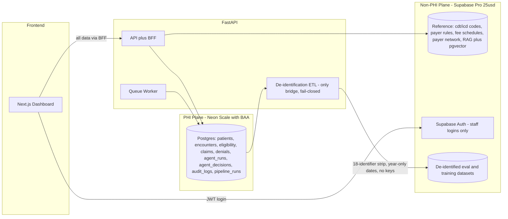
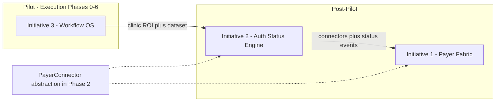

# Vanguard Production Execution Plan

**Status:** Active (July 2026) — **~85% to pilot** (Waves 0–9 engineering shipped; ops go-live pending)  
**Audience:** Engineering, product, pilot operations  
**Companion:** [vanguard-rcm-orchestration-research.md](vanguard-rcm-orchestration-research.md) (12–24 month strategy; three initiatives)  
**Supersedes:** Partial overlap with [production-roadmap.md](production-roadmap.md); this document is the authoritative **pilot engineering** plan.

**Last sync:** July 4, 2026 — Wave 9 engineering complete. **Next P0:** apply migration 007, enable shadow mode for clinic #1, daily ROI review.

## Goal

Move from MVP/demo to a production 5-clinic pilot with 2 engineers. AI agents assist; humans approve everything. First clinic live (shadow mode first) at ~week 12–14.

## Out of scope (delegated / deferred)

- **Stedi / clearinghouse commercial setup** — delegated. Engineering keeps the existing adapters ([app/eligibility/api_client.py](../app/eligibility/api_client.py), [app/integrations/stedi_claims.py](../app/integrations/stedi_claims.py)) behind env config and builds/tests against the **free Stedi sandbox**. Delegate owns: production account, payer enrollments (long lead time — start immediately), BAA, transaction billing, production API keys delivered as env vars (needed by ~week 8–10).
- **Hosting / infrastructure provisioning** — deferred per decision. The Docker image is already production-shaped; whoever picks up hosting gets `Dockerfile` + `docker-compose.yml` + `.env.example` as the contract. Note for the hosting owner: the app VM processes PHI in memory, so the provider must sign a BAA (AWS/GCP do for free; Hetzner/Contabo/OVH do not).

## Decided: two-plane data architecture (replaces Supabase Team+HIPAA at $949/mo)

- **Non-PHI plane = Supabase Pro ($25/mo, no BAA needed)**: all reference/rules/RAG/vector data — so the heavy supabase-py usage in [app/tools/coding_tools.py](../app/tools/coding_tools.py) (CDT/ICD/payer-rule lookups), [app/services/cdt_vector_memory.py](../app/services/cdt_vector_memory.py), and prior-auth rule reads **stays untouched**. Also hosts **staff authentication** (workforce identities are not PHI; the auth provider never sees patient data) and genuinely de-identified eval/training datasets.
- **PHI plane = Neon Scale** (BAA self-serve in console, usage-based ~$30–150/mo at pilot scale, pgaudit preloaded on HIPAA projects): patients, encounters, eligibility requests/checks/`raw_response`, claims, denials, agent runs/decisions, audit logs, pipeline queue. Frontend reaches it **only through FastAPI/BFF** — no browser-to-DB, no anon key, no Supabase realtime.
- **Compliance rules this lives by**: tokenization/pseudonymization does NOT make data non-PHI (if we hold a key, it is PHI); Presidio scrubbing is risk mitigation, not legal de-identification; the only bridge between planes is a Safe Harbor de-identification ETL (strip 18 identifiers, year-only dates, no linkage keys), fail-closed; clinic agreements must include a clause permitting creation of de-identified datasets.
- **Guardrails**: two physically separate projects; non-PHI connection string unavailable to PHI-handling code paths; CI check rejecting PHI-shaped columns (`patient_name`, `dob`, `subscriber_id`, `raw_response`, …) in any migration targeting the Supabase project.

## Grounded current state (July 2026)

- **Backend ([app/](../app/)):** FastAPI monolith, 5 agents + eligibility subsystem. Neon PHI layer live for core paths including voice verification sessions, fail-closed `db_phi` routing, pipeline worker (eligibility + OD writeback DLQ), unified audit writer. **Remaining Supabase runtime:** reference plane only (CDT/payer rules); apply Supabase migrations 047/048 on cutover.
- **Frontend ([eligibility_dashboard/](../eligibility_dashboard/)):** Next.js 16, auth + middleware shipped. **All RCM nav modules live via BFF** (overview, coding, prior-auth, claims, denials, analytics, eligibility, HITL). `demoData.ts` removed. No Playwright tests yet.
- **Database:** Neon DDL `001`–`005` authored/applied in dev. Supabase still holds legacy PHI views/tables pending cleanup (044 demo, eligibility views). `platform.user_practice_roles` needs production seeding.

## Phase 0 — Plane split foundation (week 1)

- [ ] Provision Neon Scale org + project, accept BAA, enable HIPAA on the project.
- [x] Table inventory: classify every table in the baseline schema as PHI-plane or non-PHI-plane — see [phi-plane-table-inventory.md](phi-plane-table-inventory.md) (24 PORT → Neon, 16 KEEP Supabase, 4 DROP demo/044, 4 CREATE new on Neon).
- [x] Author the Neon schema migrations: port PHI tables + CREATE the missing core tables (`patients`, `encounters`, `claims`, `audit_logs`, `pipeline_runs`) — plain SQL, no `anon/authenticated/service_role` grants, no `auth.uid()` defaults. **Shipped:** `neon/migrations/001`–`004` (apply after 0.1 provisioning).
- [x] De-identification ETL skeleton + CI forbidden-column guard for the Supabase project — `app/compliance/deidentification.py`, `scripts/check_supabase_migrations_phi_columns.py` (CI).

## Phase 1 — Security, tenancy, and debt eradication (weeks 1–3)

- [x] Enforce `REQUIRE_AUTH=1` in production deployments (`ENVIRONMENT=production` fail-fast in `app/main.py`)
- [x] Supabase Auth staff login in dashboard (`/login`, email/password)
- [x] Add `middleware.ts` + protected routes in `eligibility_dashboard/`
- [x] FastAPI continues verifying Supabase JWTs ([app/api/auth.py](../app/api/auth.py))
  - **Why / production impact:** prevents unauthenticated access to PHI-facing APIs and dashboard routes; production now fails fast if auth is accidentally left open.
- [x] RBAC: `user_practice_roles` (admin / billing_lead / front_office / read_only) — lives in the PHI plane; JWT carries user id, FastAPI resolves roles per request when `REQUIRE_RBAC=1`; dashboard nav role-gated via `GET /auth/me` BFF hydration ([`useStaffProfile`](../eligibility_dashboard/src/hooks/useStaffSession.ts)).
  - **Why / production impact:** separates staff permissions by practice role; admins can manage settings, billers can work queues, read-only users can inspect without changing workflow state.
- [x] Tenancy: `practice_id` on every PHI-plane table; enforced in the FastAPI data layer on every query, plus Neon Postgres RLS with per-request session GUCs as defense-in-depth.
  - **Why / production impact:** every PHI-facing FastAPI route now resolves an active tenant from `X-Practice-ID` and RBAC, server-side calls must provide a practice, current Supabase reads/writes are scoped where schema supports it, and `app.practice_id` GUC helpers are ready for Neon RLS in Phase 2.
- [ ] Supabase cleanup: drop `044` anon demo views, remove PHI tables/views from the Supabase project once Neon cutover lands.
- [x] **Rip out the mocks** (1.5): Stedi mock requires `ALLOW_CLAIM_MOCK_SUBMISSION`; no fallback on adapter errors; full-pipeline route fails closed in `NODE_ENV=production`.
  - **Why / production impact:** prevents false “submitted” claim states when the clearinghouse is down or unconfigured; operators see real failures instead of mock success.
- [x] **Fail-closed PHI scrubber**: `scrub_for_llm()` raises `PhiScrubError` on failure; LLM calls abort.
  - **Why / production impact:** PHI egress to non-BAA LLM providers stops if scrubbing cannot complete, which is safer than sending unredacted payloads.
- [x] Fix broad `except Exception` swallowing in cost calc (`services.py` re-raises) + decision service (`_safe_float` narrowed; fallback lookup logs).
  - **Why / production impact:** silent failures become visible and actionable, reducing hidden billing errors and making Sentry/log alerts useful once observability lands.

**Phase 1 summary:** Auth, RBAC, tenant selection, and production mock removal are now enforced at the application boundary. Remaining Phase 1 work is Supabase cleanup, which depends on the Phase 2 Neon cutover.

## Phase 2 — PHI data layer rewrite + app hardening (weeks 2–4)

- [x] Core PHI cutover (Neon primary, Supabase fallback where noted): [app/services/decision_service.py](../app/services/decision_service.py), [app/integrations/agent_runs.py](../app/integrations/agent_runs.py), eligibility split ([`db_phi.py`](../app/eligibility/db_phi.py) + [`db_reference.py`](../app/eligibility/db_reference.py)), claim snapshots ([`claim_snapshots.py`](../app/integrations/claim_snapshots.py)), [app/agents/rcm_pipeline.py](../app/agents/rcm_pipeline.py), dashboard store ([`app/dashboard/store.py`](../app/dashboard/store.py)).
- [ ] **Remaining PHI cutover:** [app/api/routes/rcm.py](../app/api/routes/rcm.py) full Neon-only; voice subsystem ([`app/eligibility/voice/`](../app/eligibility/voice/)); OpenDental poller/writeback; remove Supabase fallbacks once Neon is production-default.
- [x] Two settings blocks: `NEON_DATABASE_URL` (PHI) + Supabase vars (non-PHI) in `.env.example`; Neon fixtures in `tests/conftest.py`.
- [x] App hardening (partial): Sentry SDK backend, structured JSON logging + correlation IDs, unified LLM retry/timeout ([`app/llm/client.py`](../app/llm/client.py)), mypy blocking on narrow CI scope (`app/db`, `agent_runs`). **Remaining:** frontend Sentry, full mypy CI, `ClearinghouseClient` / `PayerConnector` interface.
- [ ] Vendor track (engineering side): OpenDental Remote API keys per clinic, verify OpenRouter BAA (fallback: Azure OpenAI/Bedrock for PHI-adjacent calls). Stedi BAA belongs to the delegate.

## Phase 3 — Durable pipeline & guardrails (weeks 4–6)

- [x] `pipeline_runs` worker loop in Neon ([`app/pipeline/`](../app/pipeline/)); async `/agents/rcm/full-pipeline/jobs` + status polling; dashboard BFF proxies wired.
- [x] Port `eligibility_requests` queue from Supabase edge function into pipeline worker; migrations `047`/`048` retire edge triggers and revoke Supabase PHI access.
- [x] Retry queue / dead-letter pattern for OpenDental writebacks — pipeline queue with exponential backoff, 5 attempts, Sentry alert on DLQ threshold (`pipeline_dlq_alert_threshold`).
- [x] Unified audit writer wired to pipeline, HITL, eligibility requests, decision review, claim submit, patient 360 reads; `neon/migrations/006_pgaudit.sql` for DB-level audit. **Remaining:** enable pgaudit in Neon console on HIPAA projects.
- [x] Server-side confidence gating + **block claim submit without HITL resolution** (`app/rcm/submit_gating.py`).
- [ ] Event bus + task auto-generation from coding/claims/denials/PA agent outputs (pipeline-only today).

## Phase 4 — Frontend live wiring (weeks 5–8)

- [x] **HITL Inbox** — [`/hitl`](../eligibility_dashboard/src/app/hitl/page.tsx) lists pending `agents.rcm_tasks` via BFF with approve/reject/override. **Remaining:** unified worklist across all task types.
- [x] **Coding review** — [`/coding`](../eligibility_dashboard/src/app/coding/page.tsx) reads Neon-backed cases; approve/reject calls `/review-decision` (decisions) or HITL resolve (tasks).
- [x] **Patient 360 (scaffold v1)** — [`/patients/[id]`](../eligibility_dashboard/src/app/patients/[id]/page.tsx): demographics, latest eligibility check, recent agent runs. **Remaining:** treatment plan, claim history, links from eligibility rows.
- [x] Eligibility off browser Supabase: BFF routes under [`eligibility_dashboard/src/app/api/dashboard/`](../eligibility_dashboard/src/app/api/dashboard/), 5s polling replaces realtime.
- [x] Replace `demoData.ts` on all RCM modules — home, coding, prior-auth, claims, denials, analytics read from `/api/dashboard/*` BFF.
- [x] Auth hardening: `GET /auth/me` role hydration; null-role nav bypass removed.
- [x] `error.tsx`/`loading.tsx` for eligibility + HITL. **Playwright smoke** (`eligibility_dashboard/e2e/smoke.spec.ts`) in CI. **Remaining:** middleware route-level RBAC.

## Phase 5 — ERA + agent evals (weeks 7–10)

- [x] 835/remittance adapter wired into denial agent via `Stedi835SandboxAdapter` + `era_remittance` request field (sandbox JSON).
- [x] `evals/` harness in CI — golden denial datasets via `python -m evals.runner`.

## Phase 6 — Pilot rollout (weeks 10–16)

- [ ] Design partner clinic in **shadow mode** first: OD poller read-only, daily accuracy comparison vs their billers.
- [ ] Go-live clinic #1 (~week 12–14): enable OD writebacks incrementally; HIPAA policies + Security Risk Analysis; clinic agreements include de-identified-dataset clause.
- [ ] Clinics 2–5, one per week; onboarding runbook + per-clinic ROI report.

## Strategy ↔ Execution alignment

This section maps engineering phases (weeks 0–16) to the three strategic initiatives in the [orchestration research study](vanguard-rcm-orchestration-research.md). **Build order: Initiative #3 → #2 → #1** (workflow OS first; auth-status engine second; full payer aggregator last).

| Research initiative | Phase in strategy doc | Execution phases (this doc) | Build now vs defer |
|--------------------|-----------------------|------------------------------|-------------------|
| **#3 Biller Workflow OS** — HITL inbox, task queues, agent-assisted work, multi-clinic ops | Phase 1 (month 0–6) | **0–6** (all phases) | **Build now** — primary pilot deliverable |
| **#2 Real-Time Auth Status Sync** — hybrid API/agentic monitoring, SLA alerts | Phase 2 (month 4–12) | **Design in 3–4**; **thin slice after week 16** | **Defer product build** until clinic #1 live; manual auth tracking in workflow OS until then |
| **#1 Unified Payer Portal Aggregator** — single pane, multi-payer normalization, AI summaries | Phase 3 (month 9–24) | **Abstraction only in 2–3**; **no aggregator UI in pilot** | **Defer** as product; **do not defer** internal `PayerConnector` shape |

### Per execution phase

| Phase | Weeks | Initiative focus | Concrete deliverables tied to strategy |
|-------|-------|------------------|----------------------------------------|
| **0** Plane split | 1 | #3 foundation | Neon PHI schema incl. `tasks`/`task_events`/`sla_policies` skeleton (see research §5.5); Supabase stays reference-only |
| **1** Security & tenancy | 1–3 | #3 foundation | Auth, RBAC, `practice_id` tenancy — required before any workflow OS ships |
| **2** PHI data layer | 2–4 | #3 + #1 prep | asyncpg rewrite; introduce **`ClearinghouseClient` / `PayerConnector` interface** (Stedi impl only; no portal scrapers) |
| **3** Durable pipeline | 4–6 | #3 | `pipeline_runs` worker, event bus (`eligibility.checked`, `claim.submitted`, `denial.created`, …), task auto-generation from agent outputs |
| **4** Frontend wiring | 5–8 | **#3 (ship)** | **HITL Inbox**, Patient 360, live queues (coding, claims, prior-auth, denials); wire 276/277 claim status when delegate delivers keys |
| **5** ERA + evals | 7–10 | #3 | 835/ERA live; eval harness; de-identified corpus → non-PHI plane (feeds long-term moat) |
| **6** Pilot rollout | 10–16 | #3 prove ROI | Shadow mode → go-live; per-clinic ROI metrics (research §5.5.5 KPIs); instrument override/resolution events for future #2/#1 |

### Explicitly deferred past pilot (post week 16)

- Agentic portal navigation (buy self-hosted vendor first; research §3.3, §10.5).
- Auth status adaptive scheduler + automated payer polling (Initiative #2 product).
- Full payer portal aggregator UI and AI payer summaries (Initiative #1 product).
- FHIR PAS/CRD/DTR client (2027 payer deadline — architecture-ready, not pilot scope).
- ML denial prediction on proprietary dataset (needs labeled data from workflow OS in production).

### Moat instrumentation (start in Phase 3, non-negotiable)

From research §10.7: the durable moat is the **proprietary operational dataset** (denials, appeals, payer behavior, human resolutions). From pilot week 1, log every human override, task resolution, appeal outcome, and payer-specific pattern into `audit_logs` / `task_events` — this is what makes Initiatives #2 and #1 defensible later, not the integrations alone.

## Budget (engineering-relevant; hosting + Stedi delegated)

- Data layer: Supabase Pro $25 + Neon Scale usage-based ~$30–150 = **~$60–175/mo** (vs $949/mo for Supabase Team+HIPAA).
- Other: OpenDental API ~$30/clinic, OpenRouter LLM $30–100, Jina ~$10, Sentry free tier to start.
- Rejected: Supabase Team+HIPAA ($949 flat), Clerk (BAA appears Enterprise-only), Kubernetes, LangGraph migration, microservices, Datadog, voice AI.

## Critical path

Plane split + auth/tenancy + mock removal → **core PHI on Neon (done)** → **pipeline worker + confidence gating (done)** → **HITL inbox + claim persistence + coding review (done)** → **live module wiring for PA/claims/denials/home (next)** → eligibility edge migration + OD DLQ + Supabase cleanup → evals/ERA (sandbox) → shadow pilot → go-live.

External schedule risks owned by the delegate: payer enrollments and clearinghouse production keys, needed by ~week 8–10.

## Next engineering waves (ordered)

| Wave | Focus | Exit gate |
|------|-------|-----------|
| **5** | Workflow OS + Claim: persist drafts → `rcm.claims`, submit → `accepted_claims`, `rcm_tasks` writers from coding/PA/denial; HITL resolve API; `/review-decision` wired in coding UI | **Done** — claims/coding in HITL; coding approve/reject persists to Neon |
| **6** | Live frontend: replace `demoData.ts` on home/PA/claims/denials/analytics via BFF | **Done** — all nav modules read from Neon-backed APIs |
| **7** | Pipeline tail: eligibility edge → worker, OD writeback DLQ, audit everywhere, Supabase PHI cleanup | **Done** — fail-closed Neon PHI, voice on Neon, submit gating, migrations 047/048/006 |
| **8** | ERA wire-up + `evals/` CI harness + Playwright smoke | **Done** — Stedi sandbox JSON in denial path; golden evals; Playwright CI job |
| **9** | Shadow pilot → go-live clinic #1 → clinics 2–5 | **Engineering done** — `PILOT_SHADOW_MODE`, `platform.pilot_shadow_events`, ROI API `/dashboard/pilot/shadow-summary`, claim submit blocked in shadow; **ops:** migration 007, seed roles, daily report via `scripts/pilot_shadow_report.py` |
