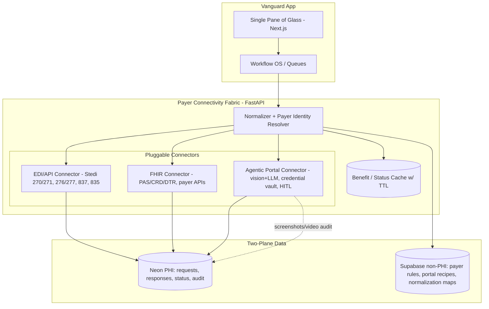
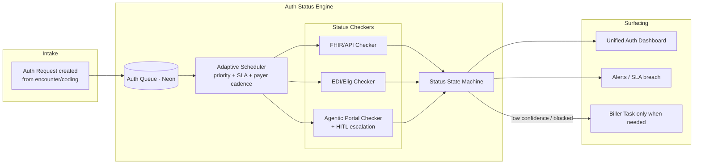
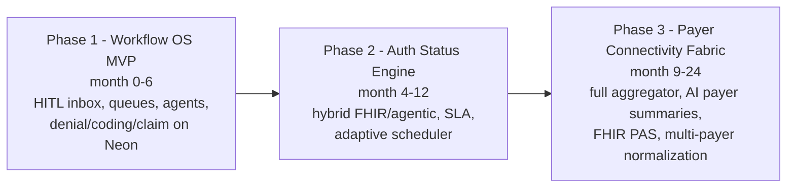

# Vanguard MD — AI-Powered RCM Orchestration Platform: Research & Strategy Study

**Status:** Research deliverable (June 2026)
**Audience:** Founders, board, engineering leadership, pilot operations
**Companion docs:** [vanguard-production-execution-plan.md](vanguard-production-execution-plan.md) (pilot engineering plan; includes **Strategy ↔ Execution alignment** mapping phases 0–6 to initiatives #1–#3), [production-roadmap.md](production-roadmap.md) (phased platform roadmap)
**Scope:** Three initiatives — (1) Unified Payer Portal Aggregation, (2) Real-Time Authorization Status Sync, (3) Deep Biller Workflow Tooling — plus competitive, regulatory, architecture, and ROI analysis.

> **Framing.** Vanguard MD is an AI-first **operational intelligence layer** that sits on top of the PMS/EHR (today: OpenDental as system of record), **not** a replacement. It minimizes PHI storage, uses OpenDental as the book of record, and earns its keep by aggregating data, orchestrating workflows, automating repetitive tasks, surfacing insight, and coordinating human billers. This study assumes a venture-backed company scaling from pilot clinics to hundreds of practices.

---

## 1. Executive Summary

### 1.1 The thesis

The RCM "intelligence layer" market has a structural opening. Incumbents fall into three camps, and none owns the position Vanguard is targeting:

- **Enterprise outsourcers** (R1, Ensemble) — percentage-of-collections, hospital-scale, 12–20 week implementations, and they *take over* your staff. Wrong shape for independent and group dental/specialty practices.
- **Clearinghouse + analytics suites** (Waystar, Availity, Change/Optum, Experian Health) — strong rails (EDI, eligibility, claim status, a multi-payer portal), but they are *transaction* platforms first; their workflow tooling is bolted onto a clearinghouse, and their "AI" is mostly rules + ML on top of an established product.
- **AI-native point tools** (AKASA, Infinx, Thoughtful AI/Smarter, Adonis, SmarterDx) — purpose-built agents, but each leans into a slice (auth status monitoring, denial integrity, anomaly detection) and most are tuned for medical/hospital, not dental + OpenDental.

Vanguard's wedge is the **intersection that nobody owns for the independent/group dental & specialty segment**: an AI-native *operating system for billers* that unifies fragmented payer surfaces and orchestrates human + agent work on top of OpenDental, with PHI minimized via a two-plane data architecture.

### 1.2 The three initiatives, ranked

After weighted scoring (Section 9), the recommendation is unambiguous:

| Rank | Initiative | Why |
|------|-----------|-----|
| **Phase 1 (MVP, now → month 6)** | **#3 Biller Workflow OS** | Largest moat, fastest to a usable product on the existing codebase, earliest revenue, lowest regulatory load. It is the *container* that makes #1 and #2 valuable. |
| **Phase 2 (month 4 → 12)** | **#2 Real-Time Auth Status Sync** | Highest acute pain, strong differentiation, rides a regulatory tailwind (CMS-0057-F). Hybrid (API where available + agentic portal checks) is feasible now. |
| **Phase 3 (month 9 → 24)** | **#1 Unified Payer Portal Aggregator** | Biggest TAM and the deepest moat *if* you reach it, but the highest maintenance burden and the most contested. Best built incrementally *underneath* #2 and #3 rather than as a standalone product. |

### 1.3 The highest-ROI path (12–24 months)

**Build the biller workflow OS first; feed it with a thin, hybrid payer-data layer that starts with the rails you already have (Stedi 270/271, 276/277, 837D) and grows agentic portal automation only where the economics demand it.** Authorization status sync is the killer feature that turns the workflow OS from "nice dashboard" into "can't-live-without-it." The full payer-portal aggregator is a *consequence* of doing #2 and #3 well, not a separate moonshot.

Concretely: the moat is not any single integration — it is the **proprietary dataset of denials, appeals, payer behavior, and human resolutions** captured by being the system billers work in every day. That dataset is what makes the agents progressively better and is impossible for a clearinghouse to replicate from transaction logs alone.

---

## 2. Where Vanguard Stands Today (grounded baseline)

This study is anchored to the *actual* codebase, not aspiration.

**Backend** (`app/`): FastAPI monolith; 5 agents + a 7-layer eligibility subsystem; Stedi 270/271 eligibility and 837D dental claim adapters; OpenDental client/poller/writeback; ~219 tests; CI (ruff/pytest/SBOM). Gaps: auth off by default, sync-only pipeline, 835/ERA mock-only, mock fallbacks in the claims path.

**Frontend** (`eligibility_dashboard/`): Next.js 16, polished; only the Eligibility module is live (direct browser→Supabase reads + realtime). Other modules (coding, claims, prior auth, denials, analytics) render from `demoData.ts`. No auth/middleware/tests yet.

**Data architecture (decided):** two planes — **Neon (PHI, BAA)** for patients/encounters/eligibility/claims/denials/agent runs/audit; **Supabase Pro (non-PHI)** for reference data, payer rules, CDT/ICD, RAG/pgvector, staff auth, and de-identified eval sets. Only bridge is a Safe-Harbor de-identification ETL (fail-closed). ~$60–175/mo data tier vs. the rejected $949/mo Supabase Team+HIPAA.

**Domain shape:** dental-first (CDT codes, OpenDental). The display contracts in `eligibility_dashboard/src/lib/rcm/types.ts` already model `CodingCase`, `PriorAuthCase`, `ClaimCase`, `DenialCase`, and a `JourneyStage` pipeline (`eligibility → coding → prior_auth → claim → denial`). This is the skeleton of the workflow OS — it just needs a durable backend, a queue/state machine, and live wiring.

**Implication:** Initiative #3 (workflow OS) is mostly *finishing and hardening what exists*. Initiatives #2 and #1 are *new capability* on top. That ordering is also the order of least → most new engineering risk, which reinforces the phasing.

---

## 3. Research Area 1 — Unified Payer Portal Aggregator

### 3.1 Goal

Let a biller see eligibility, claim status, auth status, ERA/EOB, and provider/payment data from many payers inside one Vanguard pane, instead of logging into dozens of portals.

### 3.2 Existing solutions & their limits

| Player | What they aggregate | Approach | Key limitation for Vanguard's segment |
|--------|--------------------|---------|----------------------------------------|
| **Availity Essentials** | Eligibility, claim status, auth submit/status, remits, appeals across a large network (claims ~13B txns/yr, ~170M lives) | Health-plan-*sponsored* multi-payer portal + APIs | It's a *portal*, not an embeddable data layer; free tier limited to sponsoring payers (Essentials Plus adds ~70 elig / ~50 claim-status payers for a fee). You're a tenant, not an orchestrator. Medical-leaning. |
| **Waystar** | Eligibility, claim status, auth (Authorization Manager + AltitudeAI), denials, payments | Clearinghouse + rules engine + RPA/AI; deep EHR integrations (Epic/Cerner/Meditech) | Transaction-priced, enterprise sales motion, thin dental/OpenDental story; you don't own the workflow surface. |
| **Change Healthcare / Optum** | Largest clearinghouse rails; eligibility, claims, ERA | EDI at scale | Post-breach trust issues; platform, not orchestration layer; enterprise. |
| **Experian Health (ClaimSource)** | Claim scrubbing, denial analytics, eligibility | RCM suite | Enterprise; not an agent platform. |
| **Zelis** | Payments, network, price transparency | Payer-side rails | Payer-oriented, not provider workflow. |
| **Rhyme** | Prior auth automation | Touchless ePA inside Epic; interfaces to Availity APIs | Auth-only, Epic-centric, payer-collaboration model. |
| **AKASA** | Auth determination + **auth status monitoring**, eligibility | AI + human-in-the-loop on portals/EHR work queues | Best-in-class at auth status, but a managed-service feel; hospital/medical. |
| **Stedi** | Eligibility (270/271), claim status (276/277), claims (837P/D/I), remits — **3,400+ payers, medical & dental** | Modern JSON API clearinghouse | **No 278 prior-auth submission**; auth *requirement* signaled via 271 `authOrCertIndicator`, but **no auth status retrieval**. This is exactly Vanguard's gap to fill. |

**The structural truth:** API/EDI rails (Stedi, Availity APIs) solve eligibility, claim status, claims, and remits cleanly. They **do not** solve *prior-auth status* or the long tail of payer-portal-only data. That residue is where browser automation / agentic navigation is the only option — and it's where AKASA, Skyvern, Optexity, and Waystar's RPA all live.

### 3.3 Technical approaches compared

| Approach | Tech complexity | Reliability | Compliance | Scalability | Maintenance | Cost |
|----------|----------------|-------------|------------|-------------|-------------|------|
| **API integrations** (payer FHIR/REST, Availity APIs) | Low–Med | High | Clean (BAA, OAuth) | High | Low | Low per txn; integration effort per payer |
| **EDI transactions** (270/271, 276/277, 837, 835, 278) via clearinghouse | Med | High | Clean, HIPAA-native | Very high | Low (vendor owns payer conns) | Per-txn fees |
| **Browser automation** (deterministic, recorded flows; Playwright-style) | Med–High | Med (breaks on UI change) | Manageable (BAA, credential vault, audit) but ToS-sensitive | Med | **High** (per-portal upkeep) | Med (compute + upkeep labor) |
| **RPA** (UiPath-class) | High | Med | Manageable | Low–Med | Very high | High (licenses + dev) |
| **Agentic AI navigation** (vision+LLM reads portals by meaning, e.g. Skyvern/Optexity-style) | High | Med→improving | Manageable; self-hosted/VPC for HIPAA; full screenshot/video audit trail | Med–High (parallel sessions) | **Lower than RPA** (self-healing, no hardcoded selectors) | Med–High (LLM/vision compute) |
| **Hybrid** (API/EDI first, agentic fallback) | Med–High | High overall | Clean for the API portion; contained risk for the agent portion | High | Med | Optimized — pay for automation only where rails don't reach |

**Recommendation: Hybrid, API/EDI-first.** Use Stedi (and later Availity APIs / payer FHIR) for everything the rails cover. Reserve agentic browser automation for the residue — primarily **prior-auth status** and payer-portal-only artifacts. Treat agentic navigation as a *capability behind an internal interface*, so you can buy (Skyvern/Optexity self-hosted) or build per payer without changing the rest of the system.

### 3.4 What can realistically be pulled

| Source | Channel that works today | Notes |
|--------|--------------------------|-------|
| Eligibility / benefits | Stedi 270/271 (real-time + batch) | Includes `authOrCertIndicator` (Y/N/U) for auth *requirement*. Already live in Vanguard. |
| Claim status | Stedi 276/277 | Wait ~2–3 days post-submit. Not yet wired in Vanguard. |
| Claims submission | Stedi 837D (dental) | Live in Vanguard; Stedi runs pre-submit edits (277CA acks in minutes). |
| ERA / EOB | 835 via clearinghouse | **Mock-only in Vanguard today** — build against sandbox (roadmap Phase E). |
| Prior-auth *requirement* | 271 `authOrCertIndicator` | Tells you *if* auth needed, not status of a submitted request. |
| Prior-auth *submission* | 278 (not via Stedi) / payer portals / Availity / Rhyme / FHIR PAS (future) | **Gap.** Portal/agentic today; FHIR PAS by 2027 (Section 4). |
| Prior-auth *status* | Payer portal / phone today; webhooks rare | **The biggest unmet need** — agentic monitoring (Section 4). |
| Provider/payment portals | Portal-only mostly | Agentic fallback. |

### 3.5 Recommended architecture — "Payer Connectivity Fabric"

A normalization layer with pluggable connectors behind one internal contract, so the rest of Vanguard never knows whether a fact came from EDI, an API, or an agent.



**Design principles:**

- **One internal `PayerConnector` protocol**: `check_eligibility`, `get_claim_status`, `submit_auth`, `get_auth_status`, `fetch_remit`. Implementations: `EdiConnector` (Stedi), `FhirConnector`, `AgenticConnector`. Mirrors the existing `ClearinghouseClient` abstraction the roadmap already calls for — extend, don't reinvent.
- **Payer identity resolution & normalization** in the non-PHI plane (payer IDs/aliases, plan mapping, normalization maps, agentic "portal recipes"). No PHI here.
- **Caching with TTL** for benefits/status to avoid hammering portals and to keep per-txn EDI costs down.
- **AI-generated payer summaries**: an LLM pass over normalized eligibility + claim + auth records produces a per-encounter "payer brief" (what's covered, what needs auth, what's blocking) — a feature only possible once data is unified.
- **Audit-first for agentic actions**: every portal action stores screenshots/video + a decision log in the PHI plane (this is also a compliance asset and a training corpus).

### 3.6 Build vs. buy

| Component | Recommendation |
|-----------|---------------|
| EDI/API clearinghouse rails | **Buy** (Stedi — already integrated; medical+dental; modern API). Keep adapter-shaped for dual-vendor optionality. |
| Eligibility/claim-status/claims normalization | **Build** (your moat; thin, payer-aware). |
| Agentic portal navigation engine | **Buy first, then selectively build.** Pilot Skyvern/Optexity (self-hosted/VPC for HIPAA) for auth-status on the top 5–10 portals; build in-house recipes only where volume justifies and where you want to own the IP. |
| Payer rules / portal recipes / normalization maps | **Build & own** (proprietary dataset; lives in non-PHI plane). |
| FHIR PAS/CRD/DTR client | **Build later** (2026–2027 as payers go live). |

---

## 4. Research Area 2 — Real-Time Authorization Status Syncing

### 4.1 Why this is still painful

Prior auth is the #1 cause of claim denials and the top revenue-cycle bottleneck. Status is still tracked by **phone calls and manual portal checks** because: (a) there is no universal status-query standard in production, (b) the 271 only tells you auth is *required*, not the *status* of a submitted request, (c) clearinghouses (incl. Stedi) don't retrieve auth status, and (d) payers rarely emit events/webhooks.

### 4.2 Standards landscape (deep)

| Standard | What it is | State in 2026 | Vanguard implication |
|----------|-----------|---------------|----------------------|
| **X12 278** (005010X217 request/response; X215 inquiry) | The HIPAA-mandated auth transaction; X215 is the *inquiry* variant for status | Legally the adopted standard; uneven payer support; **not offered by Stedi**; inquiry (X215) not widely usable | The "official" status channel exists on paper but is not a reliable real-time source today. |
| **FHIR PAS** (Da Vinci `davinci-pas` IG, v2.2.x) | FHIR Bundle for auth request/response; intermediaries map to/from 278 | Maturing; the standard Vanguard should target | Build a `FhirConnector` for PAS as payers light up. |
| **CRD / DTR** (Coverage Requirements Discovery, Documentation Templates & Rules) | Discover auth requirements & gather required docs at point of order | Complementary to PAS | Powers "is auth required + what docs" with provenance. |
| **CMS-0057-F** (Interoperability & Prior Authorization Final Rule) | Mandates impacted payers expose **FHIR Prior Auth APIs**; decision SLAs | **Operational SLAs already enforceable since Jan 1, 2026** (72h urgent / 7 days standard, specific denial reasons, annual public reporting). **FHIR PAS APIs due Jan 1, 2027.** | **This is Vanguard's tailwind.** A FHIR-native auth layer is exactly what the rule rewards. Enforcement discretion: payers/providers using the FHIR API won't be penalized for skipping X12 278. |
| **Stedi** | JSON clearinghouse | Eligibility 270/271, claim status 276/277, claims, remits; **no 278/auth status** | Use for eligibility-driven "auth required?" detection; everything else is portal/FHIR. |

**Net:** Until 2027 FHIR PAS coverage is broad, **real-time auth status = hybrid**: FHIR/API where the payer offers it, **agentic portal monitoring** everywhere else, with the 271 as the cheap upstream "do we even need auth?" check.

### 4.3 Feasibility by channel

- **API/FHIR status retrieval:** A growing minority of large payers (and those racing the 2027 deadline) expose auth APIs (e.g., Aetna). Few webhooks/events today.
- **Portal scraping / agentic:** The realistic default for most payers in 2026. Vision+LLM agents (Skyvern/Optexity-class) log in (handling 2FA/CAPTCHA via credential vault + TOTP), read status, and return structured JSON with screenshot/video audit.
- **Clearinghouse auth tracking:** Limited; do not assume Stedi/most clearinghouses provide it.

### 4.4 Vanguard opportunity — the Authorization Status Engine



- **Queue + adaptive scheduler:** auth requests enter a queue; the scheduler chooses *how* and *how often* to check per payer (FHIR if available; else agentic), backing off on stable statuses and tightening near SLA deadlines.
- **Agents check; humans only on exception:** statuses update automatically; a biller task is created only when the agent is blocked, confidence is low, or an SLA breach looms.
- **State machine** (Section 6.2) gives every auth a single, auditable status across heterogeneous sources.

### 4.5 Architecture options & trade-offs

| Pattern | Pros | Cons | Cost/complexity |
|---------|------|------|-----------------|
| **Event-driven** (payer webhooks/FHIR Subscription) | Real-time, cheap at steady state | Few payers support it today | Low run cost, high coverage risk |
| **Polling** (scheduled API/portal checks) | Works everywhere | Wasteful; rate-limit/ToS risk; latency | Medium; scales with volume |
| **Agent-driven monitoring** (autonomous agents per portal) | Covers portal-only payers; self-healing | Compute cost; UI-change fragility; needs audit | Medium-high |
| **Hybrid (recommended)** | Best coverage + cost: events→polling→agent fallback, adaptive cadence | Most moving parts | Optimized |

### 4.6 Deliverables: MVP → Production → Enterprise

| | MVP (month 4–7) | Production (month 7–14) | Enterprise (month 12–24) |
|---|---|---|---|
| **Coverage** | 271 "auth required" + manual/agentic status on top 5 payers | Agentic monitoring top ~20 payers + FHIR for any available; adaptive scheduler | Full FHIR PAS/CRD/DTR; payer-by-payer event subscriptions; auto-submit auths |
| **Architecture** | Polling + 1 buy-in agent vendor (self-hosted), simple queue on Neon | Hybrid engine, state machine, SLA alerts, DLQ/retry | Multi-region, per-tenant rate governance, payer-API partnerships |
| **Human model** | Biller works a list; agent assists | Exception-only HITL | Mostly touchless; humans on edge cases |
| **Eng cost (loaded)** | ~$60–120k (2 eng, ~3 mo) + agent vendor | +~$150–300k | +$500k–$1M+ |
| **Timeline** | ~10–12 weeks after workflow OS base | +6–8 months | +6–12 months |

---

## 5. Research Area 3 — Deep Workflow Tooling for Biller Task Management

### 5.1 Goal

Make Vanguard **the operating system billers live in** — where daily work is created, prioritized, executed (agent-assisted), and measured — not just a dashboard on top of OpenDental.

### 5.2 What existing systems get right / wrong

| System | Loved | Hated | Missing |
|--------|-------|-------|---------|
| **Epic work queues (WQs)** | Powerful routing, scoring, payer-SLA rules; triage-by-dollar/aging | Build complexity; "empty/unowned WQ black holes"; needs experts; hospital-only | AI-generated tasks; cross-org portability; native agent execution |
| **Athena work queues** | Good denial categorization (reason/payer/age/$) | Used *reactively*; backlogs age past appeal deadlines; dashboards ignored | Pattern→prevention automation; proactive task gen |
| **Waystar** | Unified UI, denial prevention, analytics | Transaction-priced; enterprise; thin dental | AI-native task generation & execution |
| **Experian Health / Infinx / AKASA / R1** | Strong analytics / hybrid human ops / scale | Service-heavy; outsourced control; medical-leaning | Self-serve agent OS for independent practices |
| **OpenDental** | System of record; affordable; ubiquitous in dental | Thin native worklist/denial/auth workflow; limited analytics | Everything Vanguard adds — this is the white space |

**Cross-cutting lessons:** triage beats claim-by-claim; **one worklist** (not per-portal); assign each item to exactly one lane; sort by dollars × deadline × pattern; kill empty queues; fix root causes upstream; track first-pass yield, AR days, denial rate, touches/account.

### 5.3 AI-native workflow concepts

Agents in Vanguard should:

- **Generate tasks automatically** — from eligibility gaps, `authOrCertIndicator=Y`, low coding confidence, 277 rejections, 835 denials.
- **Prioritize** — score by dollars at risk × appeal/SLA deadline × resolution likelihood × payer behavior.
- **Predict denials** — rules+LLM `claim_risk_score` pre-submit (ML later, trained on *your* labeled 835 + human resolutions).
- **Recommend next actions** — lane assignment (correct/resubmit, provide docs, appeal, close-and-learn) with payer-specific playbook.
- **Draft appeals & payer communications** — pre-filled letters grounded in denial reason + payer policy + evidence.
- **Summarize account history** — "what happened on this claim/patient" brief.
- **Escalate exceptions** — only when confidence < threshold or blocked.

All gated by **server-side confidence thresholds** (start ~0.85, tune via evals); below-threshold output routes to HITL and cannot be submitted without a logged override — exactly the guardrail the execution plan specifies.

### 5.4 Workflow engine capabilities

Human-in-the-loop + agent-assisted execution; multi-clinic (tenant-scoped); team productivity tracking; SLA tracking & breach alerts; escalation management; and **queue intelligence** (auto-routing, re-prioritization, backlog aging, pattern detection feeding prevention rules).

### 5.5 Deliverables

#### 5.5.1 Recommended database schema (PHI plane = Neon; reference = Supabase)

```sql
-- Tenancy & identity (every PHI table carries practice_id)
practices(id, name, timezone, created_at)
users(id, email, display_name, created_at)                 -- staff identity (auth in Supabase)
user_practice_roles(user_id, practice_id, role)            -- admin|billing_lead|biller|front_office|read_only

-- Core RCM objects (system of record stays OpenDental; Vanguard holds operational state)
patients(id, practice_id, od_patient_id, mrn_hash, ...)    -- minimal PHI; pointer to OD
encounters(id, practice_id, patient_id, od_encounter_id, dos, provider_npi, payer_id, ...)
claims(id, practice_id, encounter_id, status, total_charge, submission_channel, ...)
claim_versions(id, claim_id, payload_hash, snapshot_jsonb, created_at)   -- immutable history
eligibility_checks(id, practice_id, patient_id, payer_id, raw_271, parsed_jsonb, ttl_expires_at)
auth_requests(id, practice_id, encounter_id, payer_id, procedure_code, status, sla_due_at, ...)
auth_status_events(id, auth_request_id, source, status, evidence_uri, observed_at)  -- agent/API/portal
eras(id, practice_id, claim_id, raw_835, parsed_jsonb, posted_at)
denials(id, practice_id, claim_id, reason_code, amount_at_risk, lane, status, ...)

-- Workflow OS
tasks(id, practice_id, type, ref_table, ref_id, queue, priority_score, status,
      assignee_id, due_at, sla_due_at, confidence, created_by, created_at)
task_events(id, task_id, actor_type, actor_id, action, from_status, to_status, note, created_at)
agent_runs(id, practice_id, agent, input_hash, output_jsonb, confidence, cost, created_at)
agent_decisions(id, agent_run_id, decision, rationale, human_override, override_by, created_at)
audit_logs(id, practice_id, actor_type, actor_id, action, entity, entity_id, phi_accessed, created_at)
sla_policies(id, practice_id, task_type, payer_id, threshold_minutes, escalation_chain_jsonb)

-- Reference (Supabase non-PHI): cdt_codes, icd10_codes, payer_rules, payer_network,
-- fee_schedules, portal_recipes, normalization_maps, denial_reason_taxonomy, rag_embeddings
```

Builds directly on existing display contracts in `eligibility_dashboard/src/lib/rcm/types.ts` (`CodingCase`/`PriorAuthCase`/`ClaimCase`/`DenialCase`/`JourneyStage`) and the planned `pipeline_runs`/HITL tables.

#### 5.5.2 Workflow state machine

Generic task lifecycle (TypeScript discriminated-union-friendly; use an exhaustive `never` check in switches per repo rule):

```
NEW → TRIAGED → {ASSIGNED | AGENT_WORKING}
ASSIGNED → IN_PROGRESS → {RESOLVED | BLOCKED | ESCALATED}
AGENT_WORKING → {AGENT_DONE(confidence≥θ) → AUTO_APPLY
                | NEEDS_HUMAN(confidence<θ) → ASSIGNED}
BLOCKED → ASSIGNED (on unblock)
ESCALATED → ASSIGNED(billing_lead)
RESOLVED → CLOSED   (+ optional REOPENED on new payer event)
```

Auth-specific overlay (drives Section 4):
```
DRAFT → SUBMITTED → PENDING_PAYER →
   {APPROVED | DENIED | NEEDS_INFO(→ HITL) | EXPIRED(→ resubmit)}
PENDING_PAYER --(adaptive checks)--> PENDING_PAYER   (status unchanged)
```

#### 5.5.3 Queue architecture

Logical queues over one `tasks` table, partitioned by `type` + `queue`: **coding review, claim correction, prior-auth, auth-status follow-up, denial (lanes A–D), AR follow-up, escalation**. Priority is a computed score (`amount_at_risk`, `sla_due_at`, payer pattern, resolution likelihood), recomputed on events. A unified **HITL Inbox / Global Queue** (already in the execution plan, Phase 4) is the biller's home screen.

#### 5.5.4 Event architecture

Durable worker loop on Neon (`pipeline_runs` + queue worker from the execution plan) with retry/DLQ — never drop a writeback. Events: `eligibility.checked`, `coding.scored`, `auth.required`, `auth.status_changed`, `claim.submitted`, `claim.rejected(277)`, `era.posted(835)`, `denial.created`, `task.*`. Each event can (a) create/route tasks, (b) update a state machine, (c) write audit. Frontend gets updates via SSE/polling (no browser→DB).

#### 5.5.5 KPI & productivity framework

| Layer | Metrics |
|-------|---------|
| **Financial** | Clean-claim rate (>95% target), first-pass yield by payer, denial rate (<5%), AR days, denial $ recovered, revenue leakage by reason |
| **Workflow** | Tasks created/resolved, time-in-status, touches/account, SLA breach rate, backlog aging, reopen rate |
| **Agent** | Auto-completion %, override rate, confidence calibration, agent cost/task, agent-vs-human accuracy (shadow mode) |
| **Team** | Throughput/biller, appeals authored, escalations, queue cycle time |

---

## 6. Competitive Analysis

| Competitor | Strengths | Weaknesses | Pricing model | Technical approach | Where Vanguard wins |
|-----------|-----------|------------|---------------|--------------------|---------------------|
| **Waystar** | Broad suite (clearinghouse, auth, denials, payments), AltitudeAI, big EHR integrations | Enterprise sales/pricing; thin dental/OpenDental; you don't own the workflow | Subscription + per-claim | Clearinghouse + rules + RPA/AI | Dental-first, OpenDental-native, agent-OS UX, faster/cheaper for independents |
| **Availity** | Massive sponsored multi-payer network; APIs; free base tier | Portal (you're a tenant); medical-leaning; not an orchestration layer | Free (sponsored) + Essentials Plus/Pro | Multi-payer portal + APIs | Use Availity as a *connector*; win on workflow + agents + dental |
| **Change/Optum** | Largest rails | Post-breach trust; enterprise; not orchestration | Per-txn/enterprise | EDI at scale | Lightweight, modern, segment focus |
| **Experian Health** | Claim scrub, denial analytics, eligibility | Enterprise; not agent-native | Enterprise license | RCM suite | AI-native task generation/execution |
| **AKASA** | Best-in-class auth determination + **status monitoring**, AI+HITL | Managed-service feel; hospital/medical | Enterprise/managed | AI + human-in-the-loop on portals/WQs | Self-serve, dental, owns full workflow not just auth |
| **Infinx** | Specialty fit; hybrid AI+human; faster implement | Service-heavy; control ceded | ~$150–300/provider/mo | Healthcare Revenue Cloud orchestration | Software-first control, agent transparency, dental |
| **R1 RCM** | Enterprise scale, Phare agentic platform, 20+ yrs ops | Rebadges staff; 12–20 wk implement; not for $1–10M practices | % of net patient revenue (3–7%) | Managed services + agents | Independents/groups; you keep your staff & control |
| **Thoughtful AI (Smarter)** | Autonomous execution agents | Execution-focused, less orchestration/intelligence; medical | Custom/outcome | End-to-end agent execution | Orchestration + workflow OS + dental |
| **Adonis** | Purpose-built AI, anomaly detection, denial prevention, sits atop EHR | Smaller install base; limited EDI/HL7 (relies on host); medical | Outcome-based | REST/webhooks app-layer agents | Dental + OpenDental writeback + auth-status + biller OS |
| **SmarterDx** | Revenue integrity / CDI, finds lost revenue | Narrow (clinical doc integrity); inpatient/medical | Enterprise/% of findings | ML on clinical docs | Different lane; complementary, not competitive for Vanguard's segment |

**Synthesis of where Vanguard wins:** *segment* (independent/group **dental** & specialty on **OpenDental**), *posture* (intelligence layer, not outsourcer, PHI-minimizing), *product* (**AI-native biller OS** that unifies fragmented payer surfaces and runs human+agent work), and *data moat* (proprietary denial/appeal/payer-behavior/resolution corpus). No incumbent occupies that exact box for this segment.

---

## 7. Regulatory & Compliance Considerations

- **PHI minimization, OpenDental as SoR:** keep the two-plane architecture (Neon PHI w/ BAA + Supabase non-PHI). Tokenization ≠ de-identification (if you hold a key, it's PHI); only Safe-Harbor de-id ETL crosses to the non-PHI plane, fail-closed.
- **BAAs everywhere PHI flows:** Neon, hosting (AWS/GCP sign BAAs; Hetzner/Contabo/OVH do not), OpenDental API, clearinghouse (Stedi), LLM provider (verify OpenRouter; fall back to Azure OpenAI/Bedrock for PHI-adjacent calls), and any **agentic browser-automation vendor (self-hosted/VPC)**.
- **Agentic automation specifics:** credential vaulting, TOTP/2FA handling, full screenshot/video audit trail (compliance asset *and* training data), payer **Terms-of-Service** review per portal, rate-limit etiquette. This is the area of highest legal sensitivity — contain it behind one connector and document it.
- **CMS-0057-F:** auth decision SLAs (72h urgent / 7d standard), specific denial reasons, and annual reporting are **already enforceable (Jan 2026)**; **FHIR Prior Auth APIs due Jan 2027.** Vanguard should be FHIR-PAS-ready and market the tailwind.
- **Tenancy & access:** `practice_id` on every PHI table, FastAPI-enforced + Neon RLS defense-in-depth, RBAC, unified audit writer, pgaudit. (All in the execution plan.)

---

## 8. Risks & Mitigations

| Risk | Likelihood | Impact | Mitigation |
|------|-----------|--------|------------|
| Agentic portal automation breaks on UI changes | High | Med | Vision+LLM (self-healing) over hardcoded selectors; buy a maintained vendor first; per-portal monitoring + auto-fallback to HITL |
| Payer ToS / blocking of automation | Med | High | ToS review per payer; prefer API/FHIR where available; credential-of-record from the practice; throttle; agentic only as fallback |
| Clearinghouse dependency (Stedi single vendor) | Med | Med | Keep `ClearinghouseClient` abstraction; dual-vendor optionality (Vyne/Availity APIs) |
| PHI leak across planes | Low | Very High | Fail-closed de-id ETL; CI forbidden-column guard; no PHI connection string in non-PHI paths |
| Agent errors auto-applied | Med | High | Server-side confidence gating (~0.85), HITL for low confidence, immutable override audit, shadow mode before writeback |
| FHIR PAS adoption slower than hoped | Med | Med | Hybrid design already assumes portal/agentic default; FHIR is upside, not dependency |
| Enterprise incumbents move down-market | Med | Med | Win on dental/OpenDental depth + speed + data moat before they bother |
| Long payer-enrollment lead times | High | Med | Start enrollments immediately (owned by delegate per execution plan); build on Stedi sandbox meanwhile |
| Selling "another tool" to overloaded billers | Med | High | Position as *the* worklist that *removes* portals/phone calls; shadow-mode ROI proof per clinic |

---

## 9. Business Strategy — Weighted Scoring & Phasing

### 9.1 Strategic questions

1. **Largest moat?** → **#3 Workflow OS** (proprietary denial/appeal/resolution dataset + daily-use lock-in). #2 is a strong secondary moat via auth-status data.
2. **Fastest to build?** → **#3** (mostly hardening existing code + schema/state machine/live wiring).
3. **Revenue earliest?** → **#3** (sellable as a biller productivity + denial-recovery tool on existing rails), with **#2** as the upsell that closes deals.
4. **MVP Phase 1?** → **#3**.
5. **Phase 2?** → **#2 Auth Status Sync**.
6. **Phase 3?** → **#1 Full Payer Portal Aggregator** (emerges from the connectivity fabric built underneath #2/#3).

### 9.2 Weighted scoring matrix

Scores 1–5 (5 = most favorable for Vanguard). Weights sum to 100%. *Difficulty* and *Regulatory complexity* are scored so that **higher = easier/less complex** (favorable), to keep "higher total = better."

| Criterion | Weight | #1 Portal Aggregator | #2 Auth Status Sync | #3 Workflow OS |
|-----------|-------:|:--:|:--:|:--:|
| Market demand | 20% | 5 | 5 | 4 |
| Technical feasibility (5=easier) | 15% | 2 | 3 | 5 |
| Time to market (5=faster) | 15% | 2 | 3 | 5 |
| Revenue potential | 20% | 5 | 4 | 4 |
| Competitive defensibility | 20% | 4 | 4 | 5 |
| Regulatory simplicity (5=simpler) | 10% | 2 | 3 | 5 |
| **Weighted total** | **100%** | **3.65** | **3.85** | **4.55** |

Calculation detail:
- **#1** = 0.20·5 + 0.15·2 + 0.15·2 + 0.20·5 + 0.20·4 + 0.10·2 = 1.00+0.30+0.30+1.00+0.80+0.20 = **3.65**
- **#2** = 1.00+0.45+0.45+0.80+0.80+0.30 = **3.85**
- **#3** = 0.80+0.75+0.75+0.80+1.00+0.50 = **4.55**

**Conclusion:** Phase order **#3 → #2 → #1**, which also matches engineering risk and the existing roadmap's grain.

### 9.3 Phasing map



---

## 10. Roadmaps, Cost Estimates & Final Recommendation

### 10.1 MVP roadmap (month 0–6) — Workflow OS

Builds on the execution plan's Phases 0–4. Outcome: a sellable biller OS for 1–5 pilot dental clinics.

1. Plane split (Neon PHI + Supabase non-PHI), auth/tenancy/RBAC, mock removal, fail-closed scrubber.
2. PHI data layer on Neon (asyncpg/SQLAlchemy); durable `pipeline_runs` worker + retry/DLQ.
3. **Workflow schema + task state machine + queues** (Section 5.5).
4. **HITL Inbox / Global Queue** + Patient 360; wire coding, claims, prior-auth, denials, analytics off `demoData.ts` to live Neon-backed BFF.
5. Agents: task generation, prioritization, denial/appeal drafting, account summaries; confidence gating; 835/ERA against sandbox; eval harness.
6. Shadow-mode pilot → go-live clinic #1.

### 10.2 Production roadmap (month 4–14) — + Auth Status Engine

Hybrid auth-status engine (FHIR where available + agentic portal monitoring vendor, self-hosted), adaptive scheduler, SLA alerts, unified auth dashboard, exception-only HITL. Roll clinics 2–N (one/week) with onboarding runbook + per-clinic ROI report.

### 10.3 Enterprise roadmap (month 9–24) — + Payer Connectivity Fabric / Aggregator

`PayerConnector` protocol with EDI/FHIR/Agentic implementations; payer identity resolution + normalization; AI-generated payer summaries; FHIR PAS/CRD/DTR as payers go live (2027); multi-region, per-tenant rate governance; dual-clearinghouse routing; ML denial prediction trained on the accumulated proprietary dataset.

### 10.4 Cost estimates (engineering-relevant; hosting + clearinghouse commercial delegated)

| Item | Estimate |
|------|----------|
| Data tier | Supabase Pro $25 + Neon Scale ~$30–150/mo = **~$60–175/mo** |
| OpenDental API | ~$30/clinic/mo |
| LLM (OpenRouter / Azure OpenAI / Bedrock) | ~$30–100/mo at pilot; scales with volume |
| Embeddings (Jina) | ~$10/mo |
| Sentry | Free tier → paid as scale |
| Agentic automation vendor (Skyvern/Optexity, self-hosted/VPC) | Pilot tier (negotiate); compute = LLM/vision per check |
| Clearinghouse (Stedi) | Per-txn (commercial setup delegated) |
| **People (the real cost)** | 2 eng through MVP (per execution plan); +1–2 eng + part-time RCM SME for Phases 2–3 |
| Phase 1 loaded build | ~$150–300k (people, ~6 mo) |
| Phase 2 incremental | ~$150–300k + vendor |
| Phase 3 incremental | ~$500k–$1M+ |

### 10.5 Build-vs-buy summary

| Capability | Decision |
|-----------|----------|
| Clearinghouse rails (elig/claim-status/claims/remits) | **Buy** (Stedi) — keep abstraction for dual-vendor |
| Agentic portal navigation | **Buy first** (self-hosted Skyvern/Optexity), build recipes selectively |
| Workflow OS, queues, state machine, agents, normalization, payer rules/recipes, KPI engine | **Build & own** — the moat |
| FHIR PAS/CRD/DTR client | **Build later** (2026–2027) |
| Auth/identity | **Buy** (Supabase Auth for staff) |
| Observability | **Buy** (Sentry) |

### 10.6 Recommended vendors & APIs

- **Clearinghouse:** Stedi (medical+dental, 3,400+ payers, JSON API) — already integrated.
- **Agentic automation:** Skyvern or Optexity (vision+LLM, self-heal, HIPAA via self-host/VPC, screenshot/video audit) for auth-status + portal-only data.
- **Multi-payer APIs:** Availity APIs (auth/eligibility) where advantageous; payer FHIR APIs (Aetna et al.) as they light up; Da Vinci PAS/CRD/DTR for 2027.
- **Data:** Neon (PHI, BAA), Supabase Pro (non-PHI + staff auth).
- **LLM:** OpenRouter (verify BAA) with Azure OpenAI/Bedrock fallback for PHI-adjacent calls.
- **OpenDental:** Remote API (per-clinic keys) — system of record + writeback.
- **Observability:** Sentry.

### 10.7 Competitive moat assessment

Three reinforcing moats, in order of durability:

1. **Proprietary operational dataset** (denials, appeals, payer behavior, human resolutions, agentic portal recipes) — compounds with usage; a clearinghouse can't reconstruct it from transaction logs.
2. **Workflow lock-in** — once billers run their day in Vanguard, switching cost is high.
3. **Dental/OpenDental depth + PHI-minimizing posture** — a segment + architecture incumbents don't prioritize.

The aggregator (#1) alone is *not* a durable moat (it's a maintenance race); it becomes one only when fused with #2 and #3 and fed by the dataset.

### 10.8 Final recommendation — highest-ROI path, next 12–24 months

> **Ship the AI-native biller Workflow OS first (Phase 1), make Real-Time Authorization Status Sync the flagship differentiator (Phase 2), and let the Unified Payer Portal Aggregator emerge from the connectivity fabric you build underneath them (Phase 3).**

Rationale in one line: **#3 is the fastest, cheapest, most defensible, and lowest-regulatory path to revenue on the codebase you already have; #2 is the wedge that makes it irreplaceable and rides the CMS-0057-F tailwind; #1 is the long-term TAM that you earn rather than chase.** The compounding asset across all three is the proprietary denial/appeal/payer-behavior dataset — protect and instrument it from day one, because it, not any single integration, is the moat.

---

## Appendix A — Source notes

- Payer-portal automation & vendors: Optexity, Skyvern (2026); Waystar Authorization Manager / AltitudeAI; AKASA Auth Status.
- Prior-auth standards: HL7 Da Vinci PAS IG v2.2.x; CMS-0057-F (FHIR PA API due 2027; SLAs enforceable Jan 2026); HHS X12 278 enforcement-discretion letter (Feb 2024); Redix X12-278-vs-PAS analysis.
- Clearinghouse capability: Stedi healthcare docs (270/271, 276/277, 837P/D/I, 835; `authOrCertIndicator`; no 278/auth-status).
- Multi-payer portal/network: Availity Essentials / Essentials Plus / multi-payer portal; Rhyme↔Availity↔Epic auth case study.
- RCM competitive landscape & pricing: 2026 RCM software comparisons (R1 % of collections; Infinx ~$150–300/provider/mo; Adonis outcome-based; Thoughtful AI/Smarter; SmarterDx revenue integrity).
- Biller workflow best practices: Athena/Epic work-queue triage guides; denial triage (lanes A–D) frameworks.
- Vanguard internal: `docs/vanguard-production-execution-plan.md`, `docs/production-roadmap.md`, `eligibility_dashboard/src/lib/rcm/types.ts`.
